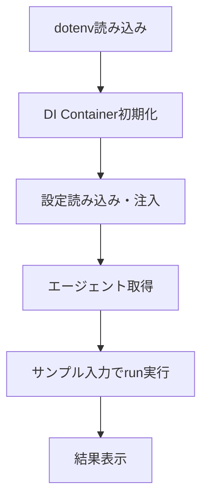

# Design Document: Agent Test Scripts

## Overview

3つのエージェント（Generator、Reflector、Curator）の動作確認用スクリプトをsrc/scripts/ディレクトリに追加する.
各スクリプトは既存のスクリプトパターン（sys.path設定、logging、main()エントリポイント）に準拠し、
DIコンテナ経由でエージェントを取得してLLM APIを実際に呼び出す.

PoCフェーズのため、簡易的な実装で一通りの動作確認ができれば十分とする.

## Architecture

### スクリプト構成

```
src/scripts/
├── run_generator.py         # Generator動作確認
├── run_reflector.py         # Reflector動作確認
├── run_curator.py           # Curator動作確認
└── fetch_jcommonsenseqa.py  # JCommonsenseQAデータ取得スクリプト
```

**削除されたスクリプト:**
- `verify_jcommonsenseqa.py` - 不要なため削除
- `example_usage.py` - 不要なため削除

### 実行フロー



### 依存関係

各スクリプトは以下のコンポーネントに依存する:

- `src.common.di.container.Container` - DIコンテナ
- `src.common.config.settings.load_config` - 設定読み込み
- `src.common.lib.logging.getLogger` - カスタムロガー取得
- `dotenv.load_dotenv` - 環境変数読み込み

スクリプト間の依存関係はない. 各スクリプトは独立して実行可能.

## Components and Interfaces

### 共通初期化パターン

各スクリプトで共通する初期化処理:

```python
from src.common.lib.logging import getLogger

logger = getLogger(__name__)

def setup() -> Container:
    """DIコンテナを初期化して返す."""
    load_dotenv()
    config = load_config()
    container = Container()
    container.config.from_dict(config.model_dump())
    return container
```

ロギング設定:
- `src.common.lib.logging.getLogger()` を使用してロガーを取得
- `getLogger()` 内で自動的に `logging.basicConfig()` が実行される
- 標準の `logging.Logger` インスタンスが返される

### run_generator.py

- `setup()` → Container
- `container.generator_agent()` → GeneratorAgent
- `agent.run(query, dataset)` → Trajectory
- Trajectoryの主要フィールドを表示

### run_reflector.py

- `setup()` → Container
- `container.generator_agent()` → GeneratorAgent（Trajectory生成用）
- `agent.run(query, dataset)` → Trajectory
- `container.reflector_agent()` → ReflectorAgent
- `reflector.run(trajectory, ground_truth, test_report, dataset)` → ReflectionResult
- ReflectionResultのInsightsとBulletEvaluationsを表示

### run_curator.py

- `setup()` → Container
- Reflectorの出力をシミュレートするため、ダミーのReflectionResultを構築
- `container.curator_agent()` → CuratorAgent
- `curator.run(reflection_result, dataset)` → CurationResult
- CurationResultのDeltas、bullets_before/after、summaryを表示

## Data Models

スクリプトで使用する既存データモデル（新規モデルの追加は不要）:

### 入力データ

| スクリプト | 入力 | 型 |
|---|---|---|
| run_generator | query, dataset | str, str |
| run_reflector | trajectory, ground_truth, test_report, dataset | Trajectory, str, str, str |
| run_curator | reflection_result, dataset | ReflectionResult, str |

### 出力データ

| スクリプト | 出力 | 表示フィールド |
|---|---|---|
| run_generator | Trajectory | query, status, generated_answer, reasoning_steps, used_bullet_ids |
| run_reflector | ReflectionResult | insights[].key_insight/reasoning/error_identification, bullet_evaluations[].bullet_id/tag/reason |
| run_curator | CurationResult | deltas[].type/section/content/reasoning, bullets_before, bullets_after, summary |

### サンプルデータ

各スクリプトにはハードコードされたサンプルデータを使用する:

- **dataset**: `"appworld"`（sections.yamlに定義済み）
- **query**: 日本語の常識推論クエリ（例: 「日本で一番高い山は何ですか？」）
- **ground_truth**: クエリに対する正解（例: 「富士山」）
- **test_report**: 簡易的なテスト結果文字列（例: 「不正解: 生成された回答が正解と一致しない」）


## Correctness Properties

*プロパティとは、システムの全ての有効な実行において成立すべき特性や振る舞いのことである. 人間が読める仕様と機械的に検証可能な正しさの保証を橋渡しする役割を持つ.*

本機能はPoCフェーズの動作確認スクリプトであり、LLM APIへの実際のリクエストを伴う. そのため、プロパティベーステストの対象は限定的である.

表示処理を関数として分離した場合、以下のプロパティが成立する:

### Property 1: 結果表示の完全性

*For any* 有効なTrajectory、ReflectionResult、CurationResultオブジェクトに対して、各表示関数の出力文字列は要件で指定された全フィールドの値を含む.

具体的には:
- Trajectory表示: query、status、generated_answer が出力に含まれる
- ReflectionResult表示: 各Insightのkey_insight、reasoning、error_identification が出力に含まれる
- CurationResult表示: 各DeltaContextItemのtype、section、content が出力に含まれる

**Validates: Requirements 1.4, 2.4, 2.5, 3.4, 3.5**

ただし、PoCフェーズのスクリプトであるため、表示処理を関数として分離するかどうかは実装時の判断に委ねる. 分離しない場合、このプロパティは手動確認で代替する.

## Error Handling

各スクリプトのエラーハンドリング方針:

| エラー種別 | 対処 |
|---|---|
| .envファイルが存在しない | dotenvは警告なしでスキップ. 環境変数が未設定の場合、LLMクライアント初期化時にエラー |
| OPENAI_API_KEYが未設定 | LLM呼び出し時にAPIエラー. try-exceptでキャッチしてログ出力後、sys.exit(1) |
| LLM APIリクエスト失敗 | try-exceptでキャッチしてエラー内容をログ出力後、sys.exit(1) |
| Playbookファイルが存在しない | PlaybookStore.load()が空のPlaybookを返す. エラーにはならない |
| Structured Output パース失敗 | LLMClientが例外を送出. try-exceptでキャッチ |

エラー発生時はスタックトレースを含むログを出力し、開発者がデバッグしやすくする.

## Implementation Notes

### DIコンテナの設定アクセス (2026-02-09修正)

`run_generator.py` 実行時に以下のバグが発見され、修正された:

**問題:**
- dependency_injector の設定で `config.llm.provider` が正しく解決されず、`ConfigurationOption` オブジェクトのまま渡されていた
- `provider` というキー名が dependency_injector の内部で予約されているため、ドット記法では正しく動作しない

**修正:**
- `src/common/di/container.py` で設定アクセス方法を変更
- `config.llm.provider` → `config.llm["provider"]` のブラケット記法を使用
- `config.llm.model` と `config.llm.api_key` も同様に修正

詳細は `.kiro/specs/generator-agent/design.md` の Implementation Notes セクションを参照.

### HybridSearchの引数順序 (2026-02-09修正)

`GeneratorAgent` 内で `HybridSearch.search()` の引数順序が間違っていたバグを修正:

**問題:**
- `generator.py` で `self.hybrid_search.search(playbook, search_query)` と呼び出していた
- 実際のメソッドシグネチャは `search(query: SearchQuery, playbook: Playbook)` で順序が逆

**修正:**
- `src/application/agents/generator.py` の214行目を修正
- `search(playbook, search_query)` → `search(search_query, playbook)`

これらの修正により、全てのエージェントテストスクリプトが正常に動作するようになった.

## Testing Strategy

### 方針

PoCフェーズの動作確認スクリプトであるため、自動テストは最小限とする.

### 手動テスト

各スクリプトを個別に実行し、以下を確認する:

1. `python src/scripts/run_generator.py` → Trajectoryが表示される
2. `python src/scripts/run_reflector.py` → ReflectionResultが表示される
3. `python src/scripts/run_curator.py` → CurationResultが表示される

### 自動テスト（オプション）

表示関数を分離した場合、pytestでプロパティテストを実装可能:

- **ライブラリ**: hypothesis（Python向けプロパティベーステストライブラリ）
- **対象**: Property 1（結果表示の完全性）
- **設定**: 最低100イテレーション
- **タグ**: `Feature: agent-test-scripts, Property 1: 結果表示の完全性`

ただし、現フェーズでは手動実行による確認で十分とする.
