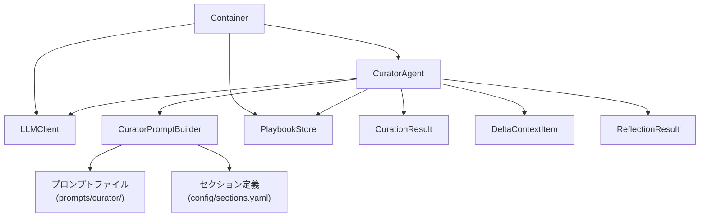
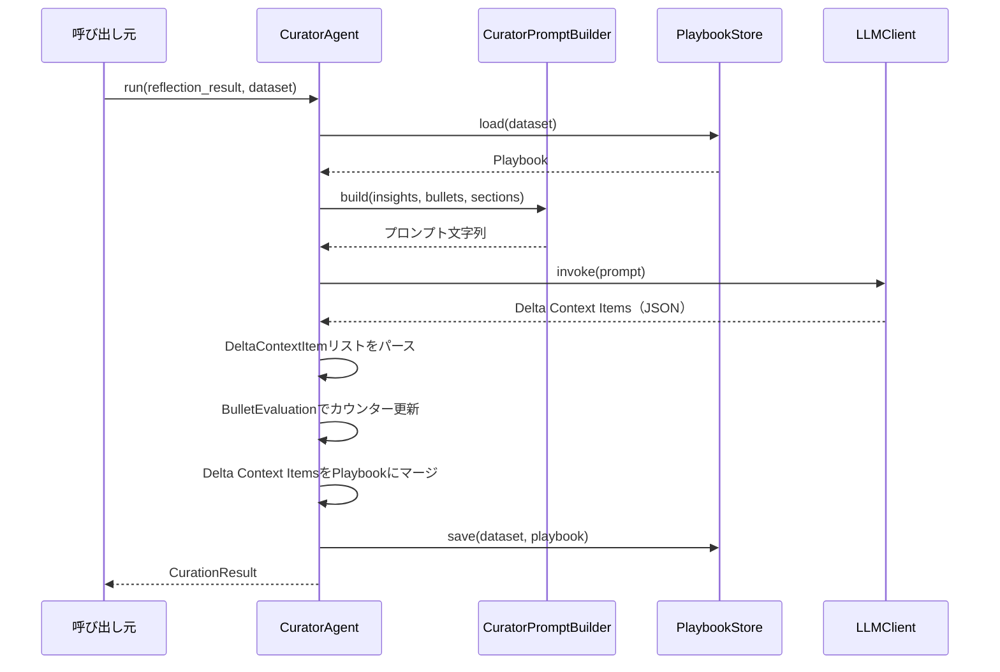
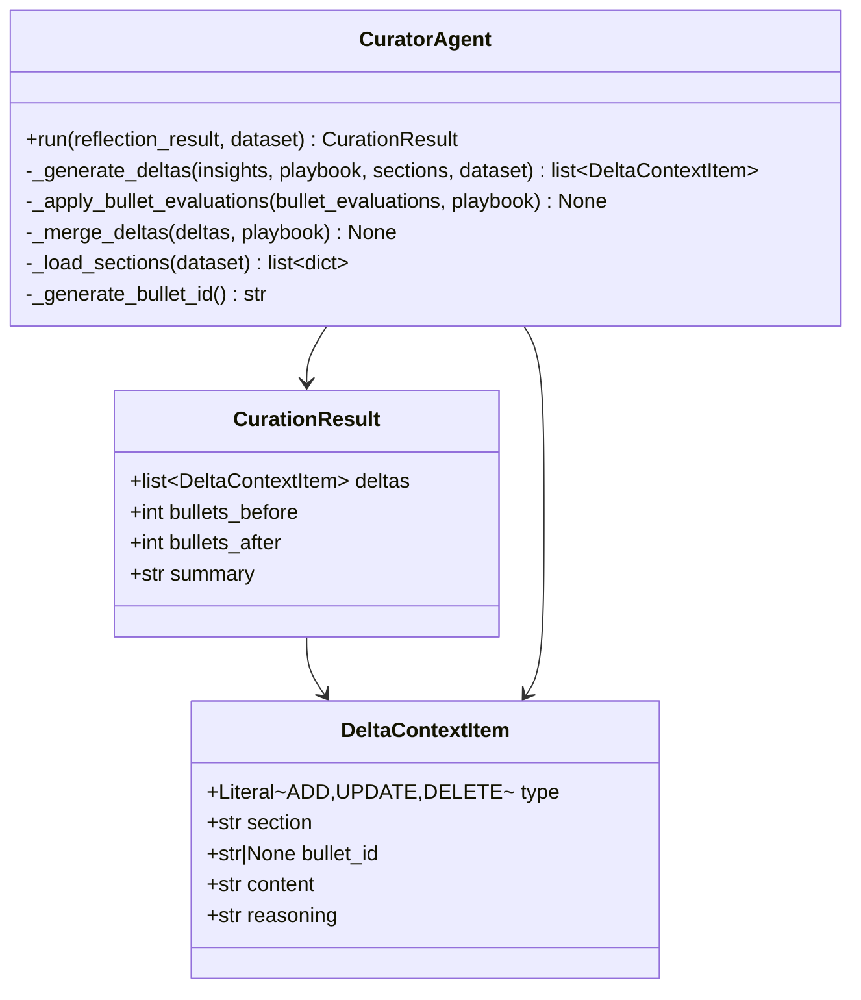

# 設計ドキュメント: Curatorエージェント

## Overview

Curatorエージェントは、ACEフレームワークにおけるキュレーションエージェントである. Reflectorが出力したReflectionResult（Insights + BulletEvaluation）を受け取り、以下の処理フローを実行してPlaybookを更新する:

1. PlaybookStoreから現在のPlaybookを読み込む
2. config/sections.yamlからセクション定義を読み込む
3. LLMを使用してInsightsからDelta Context Items（ADD/UPDATE/DELETE）を生成する
4. BulletEvaluationに基づいてBulletのhelpful/harmfulカウンターを更新する
5. Delta Context ItemsをPlaybookにマージする
6. PlaybookStoreで永続化する
7. CurationResultを返す

GeneratorAgent、ReflectorAgentと同様にapplication/agents/に配置し、LangGraphワークフローのノードとして呼び出される独立したエージェントとして設計する.

## Architecture

### 配置

```
src/
├── application/
│   └── agents/
│       └── curator.py         # CuratorAgent本体 + CuratorPromptBuilder
├── common/
│   ├── defs/
│   │   ├── curation.py        # CurationResult
│   │   └── __init__.py        # エクスポート追加
│   └── di/
│       └── container.py       # DIコンテナ（CuratorAgent追加）
prompts/
└── curator/
    └── default.txt            # デフォルトプロンプトテンプレート
```

### 依存関係



CuratorAgentはapplication層に配置し、components層（LLMClient, PlaybookStore）に依存する. CuratorPromptBuilderはCuratorAgent内のヘルパークラスとして実装し、外部ファイルからテンプレートを読み込む. HybridSearchへの直接依存は持たない（重複検出はLLMに既存Bulletリストを渡して判断させる設計とする）.

### 処理フロー



## Components and Interfaces

### 1. CuratorAgent（application/agents/curator.py）

```python
class CuratorAgent:
    """InsightsからDelta Context Itemsを生成し、Playbookを更新するエージェント."""

    def __init__(
        self,
        llm_client: LLMClient,
        prompt_builder: CuratorPromptBuilder,
        playbook_store: PlaybookStore,
    ) -> None: ...

    def run(
        self,
        reflection_result: ReflectionResult,
        dataset: str,
    ) -> CurationResult:
        """ReflectionResultを基にPlaybookを更新しCurationResultを返す.

        処理フロー:
        1. PlaybookStoreからPlaybook読み込み
        2. InsightsからDelta Context Items生成（LLM使用）
        3. BulletEvaluationでカウンター更新
        4. Delta Context ItemsをPlaybookにマージ
        5. PlaybookStoreで永続化
        6. CurationResult生成・返却
        """
        ...

    def _generate_deltas(
        self,
        insights: list[Insight],
        playbook: Playbook,
        sections: list[dict],
        dataset: str,
    ) -> list[DeltaContextItem]:
        """LLMを使用してInsightsからDelta Context Itemsを生成する."""
        ...

    def _apply_bullet_evaluations(
        self,
        bullet_evaluations: list[BulletEvaluation],
        playbook: Playbook,
    ) -> None:
        """BulletEvaluationに基づいてPlaybook内のBulletカウンターを更新する."""
        ...

    def _merge_deltas(
        self,
        deltas: list[DeltaContextItem],
        playbook: Playbook,
    ) -> None:
        """Delta Context ItemsをPlaybookに適用する."""
        ...

    def _load_sections(self, dataset: str) -> list[dict]:
        """config/sections.yamlからセクション定義を読み込む."""
        ...

    def _generate_bullet_id(self) -> str:
        """新しいBulletに一意のIDを生成する."""
        ...
```

### 2. CuratorPromptBuilder（application/agents/curator.py内）

```python
class CuratorPromptBuilder:
    """Curator用プロンプトテンプレートの読み込みと構築を行うビルダー."""

    def __init__(self, prompts_dir: str = "prompts/curator") -> None: ...

    def build(
        self,
        insights: list[Insight],
        bullets: list[Bullet],
        sections: list[dict],
        dataset: str,
    ) -> str:
        """Delta生成用プロンプト文字列を構築する.

        データセット固有のテンプレートが存在すればそれを使用し、
        存在しなければデフォルトテンプレートを使用する.
        """
        ...

    def _load_template(self, dataset: str) -> str:
        """テンプレートファイルを読み込む. データセット固有が無ければデフォルト."""
        ...
```

### 3. DIコンテナ拡張（common/di/container.py）

既存のContainerにCuratorAgent関連のプロバイダを追加する.

```python
class Container(containers.DeclarativeContainer):
    # ... 既存のプロバイダ ...

    curator_prompt_builder = providers.Singleton(
        CuratorPromptBuilder,
        prompts_dir="prompts/curator",
    )

    curator_agent = providers.Factory(
        CuratorAgent,
        llm_client=llm_client,
        prompt_builder=curator_prompt_builder,
        playbook_store=playbook_store,
    )
```

## Data Models

### CurationResultモデル（common/defs/curation.py）

```python
class CurationResult(BaseModel):
    """Curatorの出力全体を表すモデル."""

    deltas: list[DeltaContextItem]
    bullets_before: int
    bullets_after: int
    summary: str
```

### 既存モデル（変更なし）

以下のモデルは既に定義済みであり、変更は不要:

- **DeltaContextItem**（src/components/playbook_store/models.py）: type, section, bullet_id, content, reasoning
- **Bullet**（src/components/playbook_store/models.py）: id, section, content, searchable_text, keywords, helpful, harmful, source_trajectory, confidence_score
- **Playbook**（src/components/playbook_store/models.py）: metadata, bullets
- **ReflectionResult**（src/common/defs/insight.py）: insights, bullet_evaluations, trajectory_query, trajectory_dataset, iteration_count
- **Insight**（src/common/defs/insight.py）: reasoning, error_identification, root_cause_analysis, correct_approach, key_insight
- **BulletEvaluation**（src/common/defs/insight.py）: bullet_id, tag, reason

### クラス図



| モデル | フィールド | 型 | 説明 |
|---|---|---|---|
| CurationResult | deltas | list[DeltaContextItem] | 生成されたDelta操作のリスト |
| CurationResult | bullets_before | int | マージ前のBullet数 |
| CurationResult | bullets_after | int | マージ後のBullet数 |
| CurationResult | summary | str | 処理サマリー（例: "ADD: 2, UPDATE: 1, DELETE: 0"） |

### プロンプトテンプレート形式

テンプレートファイルはプレーンテキストで、Python `str.format()` 形式の変数プレースホルダを使用する.

```text
あなたはPlaybook（知識ベース）のキュレーターである.
以下のInsights（教訓）を分析し、Playbookへの更新操作を決定せよ.

## Insights
{insights}

## 現在のPlaybook
{bullets}

## 利用可能なセクション
{sections}

## 指示
- 各Insightについて、以下の操作を決定せよ:
  - ADD: 新しい知識として追加（既存Bulletと重複しない場合）
  - UPDATE: 既存Bulletの内容を更新（類似するBulletが存在する場合）
  - DELETE: 不要なBulletを削除（矛盾する知識がある場合）
- 既存Bulletと意味的に類似するInsightはUPDATE操作とし、重複追加を避けよ
- ADDの場合は利用可能なセクションから適切なものを選択せよ

## 出力形式
以下のJSON形式で回答せよ:
{{
  "deltas": [
    {{
      "type": "ADD" | "UPDATE" | "DELETE",
      "section": "セクション名",
      "bullet_id": "既存BulletのID（UPDATE/DELETEの場合）またはnull",
      "content": "Bulletの内容",
      "reasoning": "この操作を選択した理由"
    }}
  ]
}}
```

変数:
- `{insights}`: Insightのkey_insightを改行区切りで列挙
- `{bullets}`: 現在のPlaybookのBullet一覧（ID, section, content）
- `{sections}`: 利用可能なセクション名と説明の一覧


## Correctness Properties

*プロパティとは、システムの全ての有効な実行において成り立つべき特性や振る舞いのこと. 人間が読める仕様と機械的に検証可能な正しさの保証を橋渡しする形式的な記述である.*

### Property 1: CurationResultシリアライゼーションのラウンドトリップ

*For any* 有効なCurationResultオブジェクト（DeltaContextItemをネスト含む）において、`model_dump_json()`でJSON文字列にシリアライズし、`model_validate_json()`でデシリアライズした結果は、元のオブジェクトと等価である.

CurationResultはDeltaContextItemをネストしているため、このプロパティが成立すれば各サブモデルのラウンドトリップも暗黙的に検証される.

**Validates: Requirements 1.1, 1.3**

### Property 2: CurationResultの型バリデーション

*For any* 不正な型の値（例: deltasにstr、bullets_beforeにstr）をCurationResultのフィールドに渡した場合、PydanticのValidationErrorが発生する.

**Validates: Requirements 1.2**

### Property 3: BulletEvaluation適用によるカウンター更新

*For any* Playbook内の既存Bulletと、そのBulletを参照するBulletEvaluationにおいて:
- tagが"helpful"の場合、適用後にhelpfulカウンターが1増加し、harmfulカウンターは変化しない
- tagが"harmful"の場合、適用後にharmfulカウンターが1増加し、helpfulカウンターは変化しない
- tagが"neutral"の場合、適用後にhelpfulカウンターもharmfulカウンターも変化しない

**Validates: Requirements 4.1, 4.2, 4.3**

### Property 4: ADD操作によるBullet追加

*For any* PlaybookとADD操作のDeltaContextItemにおいて、_merge_deltas適用後にPlaybookのBullet数が1増加し、追加されたBulletのcontentがDeltaContextItemのcontentと一致し、sectionがDeltaContextItemのsectionと一致する.

**Validates: Requirements 5.1**

### Property 5: UPDATE操作によるBullet更新

*For any* Playbook内の既存BulletとそのBullet IDを指定したUPDATE操作のDeltaContextItemにおいて、_merge_deltas適用後に該当BulletのcontentがDeltaContextItemのcontentに更新され、Playbook全体のBullet数は変化しない.

**Validates: Requirements 5.2**

### Property 6: DELETE操作によるBullet削除

*For any* Playbook内の既存BulletとそのBullet IDを指定したDELETE操作のDeltaContextItemにおいて、_merge_deltas適用後にPlaybookのBullet数が1減少し、該当Bullet IDのBulletがPlaybook内に存在しない.

**Validates: Requirements 5.3**

### Property 7: プロンプト構築時のコンテンツ包含

*For any* 非空のInsightリスト、Bulletリスト、セクション定義リストにおいて、CuratorPromptBuilder.build()が返すプロンプト文字列には各Insightのkey_insightが含まれ、かつ各BulletのcontentとIDが含まれる.

**Validates: Requirements 6.2**

## Error Handling

### LLMリクエスト失敗

- LLMClientが例外を送出した場合、CuratorAgentはその例外をキャッチし、空のDeltaContextItemリストを持つCurationResultを返す
- カウンター更新とマージは実行されず、Playbookは変更されない
- 例外を上位に伝播させず、常にCurationResultオブジェクトを返す設計とする

### テンプレートファイル不在

- 指定データセットのテンプレートファイルが存在しない場合、CuratorPromptBuilderはデフォルトテンプレート（`prompts/curator/default.txt`）を使用する
- デフォルトテンプレートも存在しない場合は、ハードコードされたフォールバックテンプレートを使用する

### LLM応答のパース失敗

- LLMの応答がJSON形式でない、または期待するスキーマに合致しない場合、_generate_deltasは空のDeltaContextItemリストを返す
- パースエラーはログに記録する

### Bullet ID解決失敗

- UPDATE/DELETE操作で指定されたBullet IDがPlaybook内に存在しない場合、該当操作はスキップする
- スキップした操作はログに記録する

### BulletEvaluation対象不在

- BulletEvaluationのbullet_idがPlaybook内に存在しない場合、該当評価はスキップする

### セクション定義不在

- config/sections.yamlに指定データセットのセクション定義が存在しない場合、空のセクションリストとして処理を続行する

### Insightsが空

- ReflectionResultのinsightsが空の場合、LLM呼び出しをスキップし、空のDeltaContextItemリストで処理を続行する（カウンター更新は実行する）

## Testing Strategy

### PoCフェーズの方針

現在はPoCフェーズであり、テストコードは基本不要. 書く場合も最低限にとどめる.
動作確認は手動実行やスクリプトベースで十分とする.

### テストコードの配置

テストを書く場合は以下の方針に従う:
- テストコードは `tests/` ディレクトリに配置する
- テストファイル名は `test_curator.py` とする
- テストフレームワークは pytest を使用する
- 極力 `pytest.mark.parametrize` でテストケースを共通化する

### プロパティベーステスト（任意）

将来的にテストを追加する場合:
- **hypothesis**: プロパティベーステストライブラリ
- 各プロパティテストは最低100回のイテレーションで実行
- 各テストに以下のコメントを付与する:

```python
# Feature: curator-agent, Property N: {property_text}
```

### テスト対象の優先度

PoCフェーズで最低限確認すべき項目:
1. CurationResultモデルの生成・シリアライズ → 手動実行で確認
2. _apply_bullet_evaluationsのカウンター更新ロジック → 手動実行で確認
3. _merge_deltasのADD/UPDATE/DELETE操作 → 手動実行で確認
4. CuratorAgentの一連の処理フロー → 手動実行で確認

### デュアルテストアプローチ

- ユニットテスト: 特定の例、エッジケース、エラー条件の検証
- プロパティテスト: 全入力に対する普遍的なプロパティの検証
- 両者は補完的であり、包括的なカバレッジに必要
