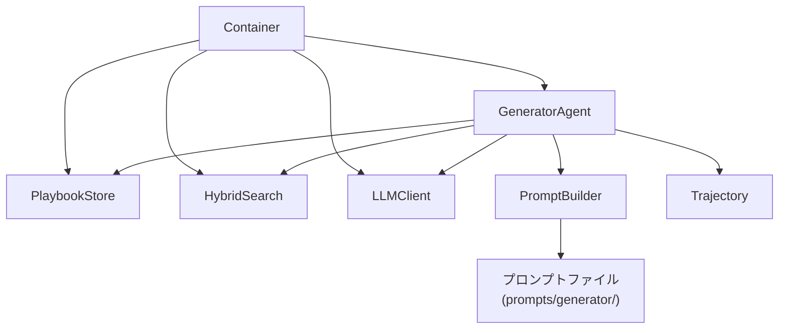
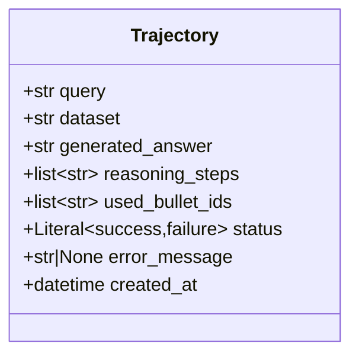

# 設計ドキュメント: Generatorエージェント

## Overview

Generatorエージェントは、ACEフレームワークにおけるタスク実行・推論エージェントである. Query（タスク）とデータセット名を受け取り、以下の処理フローを実行してTrajectory（推論過程）を出力する:

1. PlaybookStoreからPlaybookを読み込む
2. HybridSearchで関連Bulletを検索する
3. PromptBuilderでプロンプトを構築する
4. LLMClientでタスクを実行する
5. 結果をTrajectoryとして構造化する

既存のReflectionWorkflowが同様のフローを持つが、GeneratorAgentはapplication/agents/に配置し、ワークフローのノードとして呼び出される独立したエージェントとして設計する. 将来的に別のエージェントに置き換わる可能性があるため、明確なインターフェースを持つ.

## Architecture

### 配置

```
src/
├── application/
│   └── agents/
│       └── generator.py       # GeneratorAgent本体
├── common/
│   ├── defs/
│   │   └── trajectory.py      # Trajectoryデータモデル
│   └── di/
│       └── container.py       # DIコンテナ（GeneratorAgent追加）
prompts/
└── generator/
    ├── default.txt            # デフォルトプロンプトテンプレート
    └── appworld.txt           # AppWorld用テンプレート（例）
```

### 依存関係



GeneratorAgentはapplication層に配置し、components層（PlaybookStore, HybridSearch, LLMClient）に依存する. PromptBuilderはGeneratorAgent内のヘルパークラスとして実装し、外部ファイルからテンプレートを読み込む.

## Components and Interfaces

### 1. GeneratorAgent（application/agents/generator.py）

```python
class GeneratorAgent:
    """タスク実行・推論を行うエージェント."""

    def __init__(
        self,
        playbook_store: PlaybookStore,
        hybrid_search: HybridSearch,
        llm_client: LLMClient,
        prompt_builder: PromptBuilder,
    ) -> None: ...

    def run(self, query: str, dataset: str) -> Trajectory:
        """クエリを実行しTrajectoryを返す.

        処理フロー:
        1. PlaybookStoreからPlaybook読み込み
        2. HybridSearchで関連Bullet検索
        3. PromptBuilderでプロンプト構築
        4. LLMClientでタスク実行
        5. Trajectory生成・返却
        """
        ...
```

### 2. PromptBuilder（application/agents/generator.py内）

```python
class PromptBuilder:
    """プロンプトテンプレートの読み込みと構築を行うビルダー."""

    def __init__(self, prompts_dir: str = "prompts/generator") -> None: ...

    def build(self, query: str, bullets: list[Bullet], dataset: str) -> str:
        """クエリと検索結果からプロンプト文字列を構築する.

        データセット固有のテンプレートが存在すればそれを使用し、
        存在しなければデフォルトテンプレートを使用する.
        """
        ...

    def _load_template(self, dataset: str) -> str:
        """テンプレートファイルを読み込む. データセット固有が無ければデフォルト."""
        ...
```

### 3. Trajectory（common/defs/trajectory.py）

```python
class Trajectory(BaseModel):
    """Generatorの推論過程を記録するモデル."""

    query: str
    dataset: str
    generated_answer: str
    reasoning_steps: list[str]
    used_bullet_ids: list[str]
    status: Literal["success", "failure"]
    error_message: str | None = None
    created_at: datetime = Field(default_factory=datetime.now)
```

### 4. DIコンテナ拡張（common/di/container.py）

既存のContainerにGeneratorAgent関連のプロバイダを追加する.

```python
class Container(containers.DeclarativeContainer):
    # ... 既存のプロバイダ ...

    # 注意: config.llm.provider ではなく config.llm["provider"] を使用
    # "provider" という名前が dependency_injector の内部で衝突するため、
    # ブラケット記法を使用する必要がある
    chat_model = providers.Singleton(
        create_chat_model,
        provider=config.llm["provider"],
        model=config.llm["model"],
        api_key=config.llm["api_key"],
    )

    prompt_builder = providers.Singleton(
        PromptBuilder,
        prompts_dir="prompts/generator",
    )

    generator_agent = providers.Factory(
        GeneratorAgent,
        playbook_store=playbook_store,
        hybrid_search=hybrid_search,
        llm_client=llm_client,
        prompt_builder=prompt_builder,
    )
```

## Data Models

### Trajectoryモデル



| フィールド | 型 | 説明 |
|---|---|---|
| query | str | 入力クエリ |
| dataset | str | データセット名 |
| generated_answer | str | LLMの生成結果 |
| reasoning_steps | list[str] | 推論ステップの記録 |
| used_bullet_ids | list[str] | 参照したBulletのIDリスト |
| status | Literal["success", "failure"] | 実行ステータス |
| error_message | str \| None | エラー時のメッセージ |
| created_at | datetime | 生成日時 |

### プロンプトテンプレート形式

テンプレートファイルはプレーンテキストで、Python `str.format()` 形式の変数プレースホルダを使用する.

```text
以下の知識ベースを参考にして、タスクに回答してください.

## 知識ベース
{context}

## タスク
{query}

## 回答
```

変数:
- `{context}`: 検索結果のBullet内容を改行区切りで結合した文字列
- `{query}`: 入力クエリ

### JSON保存形式（Trajectory）

```json
{
  "query": "APIのレート制限を実装する方法",
  "dataset": "appworld",
  "generated_answer": "レート制限の実装には...",
  "reasoning_steps": [
    "Playbookから関連知識を検索",
    "API使用パターンのBulletを参照",
    "レート制限の実装方法を生成"
  ],
  "used_bullet_ids": ["shr-00001", "aup-00003"],
  "status": "success",
  "error_message": null,
  "created_at": "2025-01-15T10:30:00"
}
```


## Correctness Properties

*プロパティとは、システムの全ての有効な実行において成り立つべき特性や振る舞いのこと. 人間が読める仕様と機械的に検証可能な正しさの保証を橋渡しする形式的な記述である.*

### Property 1: Trajectoryシリアライゼーションのラウンドトリップ

*For any* 有効なTrajectoryオブジェクトにおいて、`model_dump_json()`でJSON文字列にシリアライズし、`model_validate_json()`でデシリアライズした結果は、元のTrajectoryオブジェクトと等価である.

**Validates: Requirements 1.1, 1.3, 1.4**

### Property 2: Trajectoryの型バリデーション

*For any* 不正な型の値（例: queryにint、statusに無効な文字列）をTrajectoryのフィールドに渡した場合、PydanticのValidationErrorが発生する.

**Validates: Requirements 1.2**

### Property 3: プロンプト構築時のコンテンツ包含

*For any* 非空のクエリ文字列と任意のBulletリストにおいて、PromptBuilder.build()が返すプロンプト文字列にはクエリ文字列が含まれ、かつ各Bulletのcontentが含まれる.

**Validates: Requirements 2.2, 3.2**

### Property 4: LLM応答からのTrajectory構造化

*For any* LLMの応答文字列において、GeneratorAgentが生成するTrajectoryのgenerated_answerフィールドはその応答文字列を含み、statusは"success"である.

**Validates: Requirements 4.2, 5.3**

## Error Handling

### LLMリクエスト失敗

- LLMClientが例外を送出した場合、GeneratorAgentはその例外をキャッチし、status="failure"、error_messageにエラー内容を設定したTrajectoryを返す
- 例外を上位に伝播させず、常にTrajectoryオブジェクトを返す設計とする

### テンプレートファイル不在

- 指定データセットのテンプレートファイルが存在しない場合、PromptBuilderはデフォルトテンプレート（`prompts/generator/default.txt`）を使用する
- デフォルトテンプレートも存在しない場合は、ハードコードされたフォールバックテンプレートを使用する

### Playbook空

- Playbookが空（Bulletが0件）の場合、検索結果は空リストとなる
- 空の検索結果でもプロンプト構築・LLM実行は正常に行われる（コンテキスト部分が空になるだけ）

### 検索失敗

- HybridSearchが例外を送出した場合、GeneratorAgentはLLMリクエスト失敗と同様にstatus="failure"のTrajectoryを返す

## Implementation Notes

### DIコンテナの設定アクセス

dependency_injector を使用する際、設定値へのアクセスには注意が必要である:

- **推奨**: `config.section["key"]` のブラケット記法を使用
- **非推奨**: `config.section.key` のドット記法（特定のキー名で衝突が発生する可能性）

特に `provider` というキー名は dependency_injector の内部で予約されているため、`config.llm.provider` は正しく解決されない. 必ず `config.llm["provider"]` の形式を使用すること.

### HybridSearchの引数順序

HybridSearch.search() メソッドの引数順序は以下の通り:

```python
def search(self, query: SearchQuery, playbook: Playbook) -> list[SearchResult]:
    """ハイブリッド検索を実行する."""
```

- **第1引数**: `query` (SearchQuery)
- **第2引数**: `playbook` (Playbook)

GeneratorAgent内で呼び出す際は、以下のように正しい順序で渡すこと:

```python
search_query = SearchQuery(query_text=query, top_k=10)
results = self.hybrid_search.search(search_query, playbook)  # 順序に注意
```

## Testing Strategy

### PoCフェーズの方針

現在はPoCフェーズであり、テストコードは基本不要. 書く場合も最低限にとどめる.
動作確認は手動実行やスクリプトベースで十分とする.

### テストコードの配置

テストを書く場合は以下の方針に従う:
- テストコードは `tests/` ディレクトリに配置する
- テストファイル名は `test_generator.py` とする
- テストフレームワークは pytest を使用する
- 極力 `pytest.mark.parametrize` でテストケースを共通化する

### プロパティベーステスト（任意）

将来的にテストを追加する場合:
- **hypothesis**: プロパティベーステストライブラリ
- 各プロパティテストは最低100回のイテレーションで実行
- 各テストに以下のコメントを付与する:

```python
# Feature: generator-agent, Property N: {property_text}
```

### テスト対象の優先度

PoCフェーズで最低限確認すべき項目:
1. Trajectoryモデルの生成・シリアライズ → 手動実行で確認
2. PromptBuilderのテンプレート読み込み・変数展開 → 手動実行で確認
3. GeneratorAgentの一連の処理フロー → 手動実行で確認

### デュアルテストアプローチ

- ユニットテスト: 特定の例、エッジケース、エラー条件の検証
- プロパティテスト: 全入力に対する普遍的なプロパティの検証
- 両者は補完的であり、包括的なカバレッジに必要
