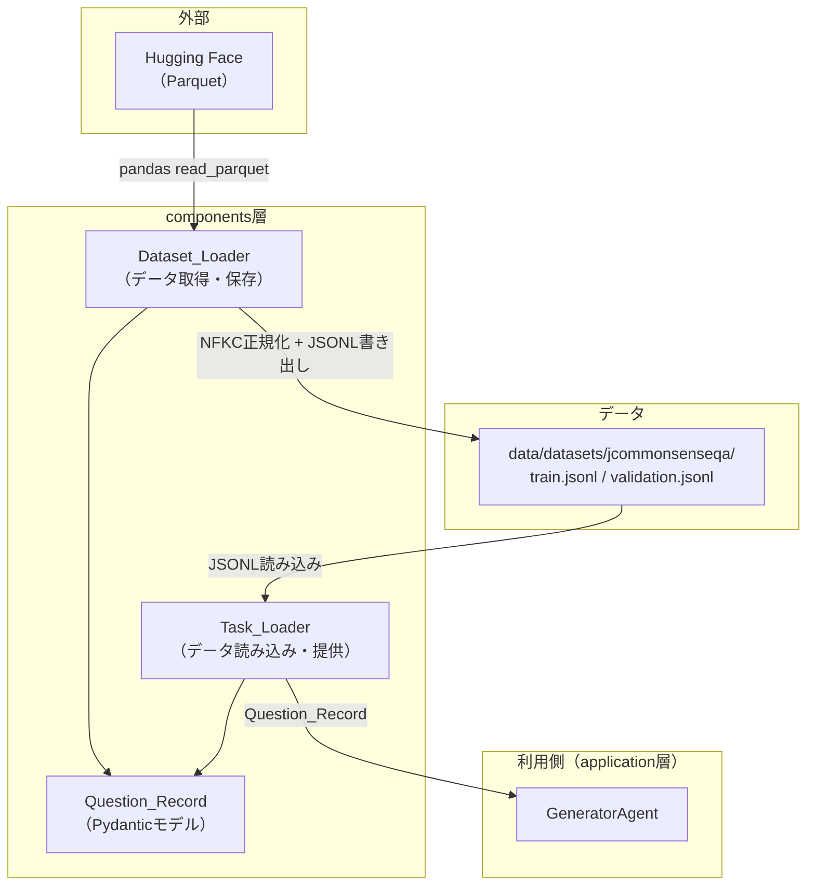

# 設計書: JCommonsenseQA データセットローダー

## 概要

JCommonsenseQAデータセット（Hugging Face: sbintuitions/JCommonsenseQA）を取得・保存・読み込みするためのコンポーネント群を設計する. プロジェクトの既存アーキテクチャ（components層 + application層）に沿い、以下の2つのコンポーネントを構築する:

1. **Dataset_Loader**（`src/components/dataset_loader/`）: HFからのデータ取得、NFKC正規化、JSONL保存
2. **Task_Loader**（`src/components/task_loader/`）: JSONL読み込み、クエリ変換、正解判定

components層に配置するため、application層やcommon層への依存は持たない. Pydanticとpandasのみに依存するシンプルな設計とする.

## アーキテクチャ



### 配置方針

- `src/components/dataset_loader/`: Dataset_Loader本体とQuestion_Recordモデル
- `src/components/task_loader/`: Task_Loader本体
- `data/datasets/jcommonsenseqa/`: 保存先ディレクトリ
- Question_Recordモデルはdataset_loaderパッケージ内のmodels.pyに定義し、task_loaderからもimportする

## コンポーネントとインターフェース

### Question_Record（Pydanticモデル）

```python
class QuestionRecord(BaseModel):
    q_id: str
    question: str
    choice0: str
    choice1: str
    choice2: str
    choice3: str
    choice4: str
    label: int  # 0〜4, バリデーション付き

    @property
    def correct_answer(self) -> str:
        """labelに対応するchoiceの値を返す."""

    def to_query(self) -> str:
        """question + 選択肢をフォーマットしたクエリ文字列を返す."""
```

### Dataset_Loader

```python
class DatasetLoader:
    def __init__(self, output_dir: str = "data/datasets/jcommonsenseqa") -> None: ...

    def fetch_and_save(self) -> dict[str, int]:
        """HFからデータ取得、NFKC正規化、JSONL保存. split名→件数のdictを返す."""

    def _fetch_split(self, split: str) -> list[QuestionRecord]:
        """指定splitをHFから取得しQuestionRecordリストに変換."""

    def _normalize_nfkc(self, text: str) -> str:
        """NFKC正規化を適用."""

    def _save_jsonl(self, records: list[QuestionRecord], split: str) -> None:
        """QuestionRecordリストをJSONLファイルに保存."""
```

### Task_Loader

```python
class TaskLoader:
    def __init__(self, data_dir: str = "data/datasets/jcommonsenseqa") -> None: ...

    def load(self, split: str) -> list[QuestionRecord]:
        """指定splitのJSONLファイルからQuestionRecordリストを読み込む."""

    def evaluate(self, record: QuestionRecord, answer: str) -> bool:
        """Generatorの回答とlabelを比較して正誤判定."""
```

## データモデル

### QuestionRecord

| フィールド | 型 | バリデーション | 説明 |
|---|---|---|---|
| q_id | str | 必須 | 質問ID |
| question | str | 必須 | 質問文（NFKC正規化済み） |
| choice0〜choice4 | str | 必須 | 5つの選択肢（NFKC正規化済み） |
| label | int | 0〜4の範囲 | 正解選択肢のインデックス |

### ファイル構成

```
data/datasets/jcommonsenseqa/
├── train.jsonl        # 8,940件
└── validation.jsonl   # 1,120件
```

### JSONLフォーマット（1行の例）

```json
{"q_id": "123", "question": "日本で一番高い山はどれ?", "choice0": "富士山", "choice1": "北岳", "choice2": "奥穂高岳", "choice3": "間ノ岳", "choice4": "槍ヶ岳", "label": 0}
```

### クエリフォーマット（to_queryの出力例）

```
質問: 日本で一番高い山はどれ?
選択肢:
  0: 富士山
  1: 北岳
  2: 奥穂高岳
  3: 間ノ岳
  4: 槍ヶ岳
```


## 正当性プロパティ

*プロパティとは、システムの全ての有効な実行において成立すべき特性や振る舞いのことである. 人間が読める仕様と機械的に検証可能な正当性保証の橋渡しとなる.*

### Property 1: NFKC正規化の冪等性

*For any* 文字列に対して、NFKC正規化を1回適用した結果と2回適用した結果は等価である. つまり `normalize(normalize(text)) == normalize(text)` が成立する.

**Validates: Requirements 1.3**

### Property 2: labelバリデーション

*For any* 整数値に対して、0〜4の範囲外であればQuestionRecordの生成時にバリデーションエラーが発生する.

**Validates: Requirements 2.2**

### Property 3: correct_answerと正解判定の一貫性

*For any* 有効なQuestionRecordに対して、correct_answerプロパティは `choice{label}` の値と一致し、その値をevaluateメソッドに渡した場合にTrueを返す. また、correct_answer以外の選択肢を渡した場合にFalseを返す.

**Validates: Requirements 2.3, 3.4**

### Property 4: to_queryの完全性

*For any* 有効なQuestionRecordに対して、to_query()の出力文字列にはquestionフィールドの値とchoice0〜choice4の全ての値が含まれる.

**Validates: Requirements 3.3**

### Property 5: JSONLラウンドトリップ

*For any* 有効なQuestionRecordのリストに対して、JSONLへのシリアライズ後にデシリアライズした結果は元のリストと等価である.

**Validates: Requirements 4.1, 4.2, 4.3**

## エラーハンドリング

| エラー状況 | 処理 |
|---|---|
| HFからのデータ取得失敗（ネットワークエラー） | ログ出力 + 例外送出（元の例外をチェーン） |
| 存在しないsplit指定 | FileNotFoundError送出 |
| JSONLファイルのパースエラー | ValueError送出（行番号付きメッセージ） |
| labelが0〜4の範囲外 | Pydantic ValidationError（自動） |

## テスト戦略

### テストフレームワーク

- **ユニットテスト**: pytest
- **プロパティベーステスト**: Hypothesis（Python向けPBTライブラリ）

### プロパティベーステスト

各プロパティテストは最低100イテレーション実行する. Hypothesisの `@given` デコレータとカスタムストラテジーを使用する.

- **QuestionRecordジェネレータ**: 有効なq_id, question, choice0〜4, label（0〜4）を生成するHypothesisストラテジー
- **テストタグ形式**: `# Feature: jcommonsenseqa-dataset-loader, Property N: <property_text>`
- 各正当性プロパティは1つのプロパティベーステストで実装する

### ユニットテスト

- 具体例テスト: 実際のJCommonsenseQAデータ形式に基づく具体的なレコードでの動作確認
- エッジケース: 空文字列、特殊文字を含むquestion/choice
- エラー条件: 存在しないsplit、不正なlabel値

### テスト構成

```
tests/
├── test_question_record.py    # QuestionRecordモデルのテスト
├── test_dataset_loader.py     # DatasetLoaderのテスト
└── test_task_loader.py        # TaskLoaderのテスト
```

### PoCフェーズの方針

現在はPoCフェーズのため、テストは最低限にとどめる. プロパティベーステストはオプションとし、基本的な動作確認を優先する.
