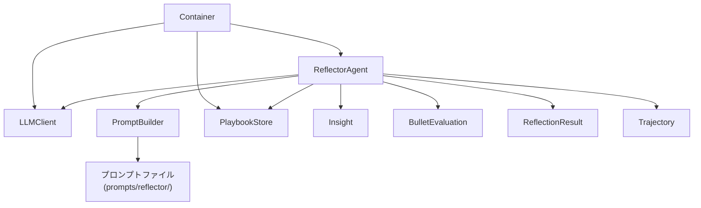
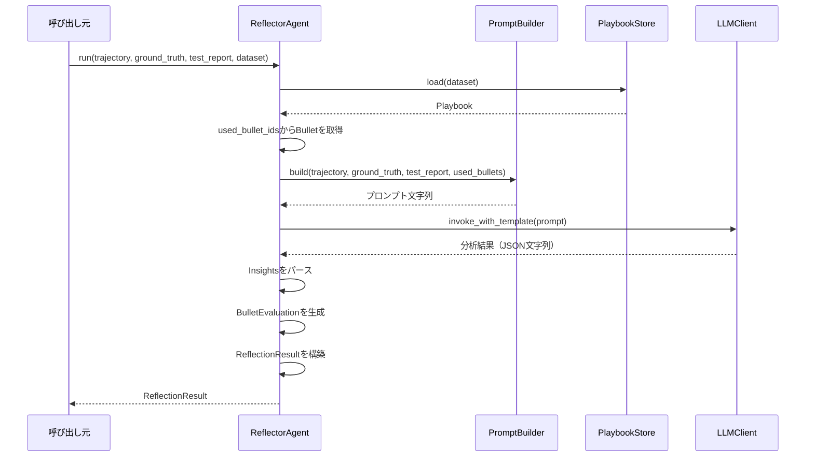
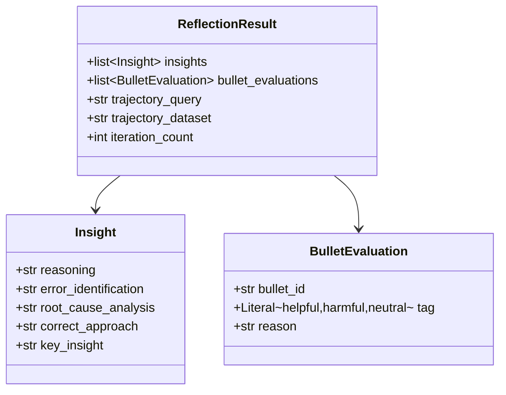

# 設計ドキュメント: Reflectorエージェント

## Overview

Reflectorエージェントは、ACEフレームワークにおける自己内省エージェントである. Generatorが生成したTrajectory（推論過程）を受け取り、正解データ（Ground Truth）やテスト結果と比較して以下の処理フローを実行し、ReflectionResult（分析結果）を出力する:

1. PromptBuilderでReflector用プロンプトを構築する
2. LLMClientで分析を実行し、Insightsを抽出する
3. 使用されたBulletの有用性を評価する（BulletEvaluation）
4. InsightsとBulletEvaluationをReflectionResultとして返す

オプションとして、反復改善（Iterative Refinement）により分析を複数回繰り返し、より深い洞察を得ることが可能.

GeneratorAgentと同様にapplication/agents/に配置し、LangGraphワークフローのノードとして呼び出される独立したエージェントとして設計する. 将来的に別のエージェントに置き換わる可能性があるため、明確なインターフェースを持つ.

## Architecture

### 配置

```
src/
├── application/
│   └── agents/
│       └── reflector.py       # ReflectorAgent本体 + PromptBuilder
├── common/
│   ├── defs/
│   │   ├── trajectory.py      # Trajectoryデータモデル（既存）
│   │   ├── insight.py         # Insight, BulletEvaluation, ReflectionResult
│   │   └── __init__.py
│   └── di/
│       └── container.py       # DIコンテナ（ReflectorAgent追加）
prompts/
└── reflector/
    └── default.txt            # デフォルトプロンプトテンプレート
```

### 依存関係



ReflectorAgentはapplication層に配置し、components層（LLMClient, PlaybookStore）に依存する. PromptBuilderはReflectorAgent内のヘルパークラスとして実装し、外部ファイルからテンプレートを読み込む. GeneratorAgentとは異なり、HybridSearchへの直接依存は不要（Reflectorは検索を行わず、Trajectoryに記録されたBullet IDを使用する）.

### 処理フロー



## Components and Interfaces

### 1. ReflectorAgent（application/agents/reflector.py）

```python
class ReflectorAgent:
    """Trajectoryを分析し、Insightsを抽出するエージェント."""

    def __init__(
        self,
        llm_client: LLMClient,
        prompt_builder: ReflectorPromptBuilder,
        playbook_store: PlaybookStore,
    ) -> None: ...

    def run(
        self,
        trajectory: Trajectory,
        ground_truth: str,
        test_report: str,
        dataset: str,
        max_iterations: int = 1,
    ) -> ReflectionResult:
        """Trajectoryを分析しReflectionResultを返す.

        処理フロー:
        1. PlaybookStoreからPlaybook読み込み
        2. used_bullet_idsに対応するBulletを取得
        3. PromptBuilderでプロンプト構築
        4. LLMClientで分析実行
        5. Insightsをパース
        6. BulletEvaluationを生成
        7. (オプション) 反復改善
        8. ReflectionResult生成・返却
        """
        ...

    def _extract_insights(self, llm_response: str) -> list[Insight]:
        """LLM応答からInsightリストをパースする."""
        ...

    def _evaluate_bullets(
        self,
        trajectory: Trajectory,
        ground_truth: str,
        used_bullets: list[Bullet],
    ) -> list[BulletEvaluation]:
        """使用されたBulletの有用性を評価する."""
        ...

    def _resolve_bullets(
        self,
        bullet_ids: list[str],
        playbook: Playbook,
    ) -> list[Bullet]:
        """Bullet IDリストからBulletオブジェクトを取得する."""
        ...
```

### 2. ReflectorPromptBuilder（application/agents/reflector.py内）

```python
class ReflectorPromptBuilder:
    """Reflector用プロンプトテンプレートの読み込みと構築を行うビルダー."""

    def __init__(self, prompts_dir: str = "prompts/reflector") -> None: ...

    def build(
        self,
        trajectory: Trajectory,
        ground_truth: str,
        test_report: str,
        used_bullets: list[Bullet],
        dataset: str,
        previous_insights: list[Insight] | None = None,
    ) -> str:
        """分析用プロンプト文字列を構築する.

        データセット固有のテンプレートが存在すればそれを使用し、
        存在しなければデフォルトテンプレートを使用する.
        反復改善時はprevious_insightsを含める.
        """
        ...

    def build_evaluation_prompt(
        self,
        trajectory: Trajectory,
        ground_truth: str,
        bullet: Bullet,
    ) -> str:
        """Bullet評価用プロンプト文字列を構築する."""
        ...

    def _load_template(self, dataset: str) -> str:
        """テンプレートファイルを読み込む. データセット固有が無ければデフォルト."""
        ...
```

### 3. DIコンテナ拡張（common/di/container.py）

既存のContainerにReflectorAgent関連のプロバイダを追加する.

```python
class Container(containers.DeclarativeContainer):
    # ... 既存のプロバイダ ...

    reflector_prompt_builder = providers.Singleton(
        ReflectorPromptBuilder,
        prompts_dir="prompts/reflector",
    )

    reflector_agent = providers.Factory(
        ReflectorAgent,
        llm_client=llm_client,
        prompt_builder=reflector_prompt_builder,
        playbook_store=playbook_store,
    )
```

## Data Models

### Insightモデル（common/defs/insight.py）

```python
class Insight(BaseModel):
    """Reflectorの分析結果を表すモデル."""

    reasoning: str
    error_identification: str
    root_cause_analysis: str
    correct_approach: str
    key_insight: str
```

### BulletEvaluationモデル（common/defs/insight.py）

```python
class BulletEvaluation(BaseModel):
    """Bulletに対する評価タグを表すモデル."""

    bullet_id: str
    tag: Literal["helpful", "harmful", "neutral"]
    reason: str
```

### ReflectionResultモデル（common/defs/insight.py）

```python
class ReflectionResult(BaseModel):
    """Reflectorの出力全体を表すモデル."""

    insights: list[Insight]
    bullet_evaluations: list[BulletEvaluation]
    trajectory_query: str
    trajectory_dataset: str
    iteration_count: int = 1
```

### クラス図



| モデル | フィールド | 型 | 説明 |
|---|---|---|---|
| Insight | reasoning | str | 思考過程 |
| Insight | error_identification | str | 何が間違っていたか |
| Insight | root_cause_analysis | str | なぜエラーが発生したか |
| Insight | correct_approach | str | 正しいアプローチ |
| Insight | key_insight | str | 覚えるべき教訓 |
| BulletEvaluation | bullet_id | str | 評価対象のBullet ID |
| BulletEvaluation | tag | Literal["helpful", "harmful", "neutral"] | 評価タグ |
| BulletEvaluation | reason | str | 評価理由 |
| ReflectionResult | insights | list[Insight] | 抽出されたInsightのリスト |
| ReflectionResult | bullet_evaluations | list[BulletEvaluation] | Bullet評価のリスト |
| ReflectionResult | trajectory_query | str | 元のTrajectoryのクエリ |
| ReflectionResult | trajectory_dataset | str | 元のTrajectoryのデータセット名 |
| ReflectionResult | iteration_count | int | 実行されたイテレーション回数 |

### プロンプトテンプレート形式

テンプレートファイルはプレーンテキストで、Python `str.format()` 形式の変数プレースホルダを使用する.

```text
あなたはコード生成エージェントの推論過程を分析するReflectorである.
以下の情報を基に、エラーの根本原因を分析し、教訓を抽出せよ.

## 生成されたコード
{generated_answer}

## 正解コード
{ground_truth}

## テスト結果
{test_report}

## 推論ステップ
{reasoning_steps}

## 参照した知識ベース
{used_bullets}

## 前回の分析結果（反復改善時のみ）
{previous_insights}

## 出力形式
以下のJSON形式で回答せよ:
{{
  "insights": [
    {{
      "reasoning": "思考過程",
      "error_identification": "何が間違っていたか",
      "root_cause_analysis": "なぜエラーが発生したか",
      "correct_approach": "正しいアプローチ",
      "key_insight": "覚えるべき教訓"
    }}
  ]
}}
```

変数:
- `{generated_answer}`: Trajectoryの生成結果
- `{ground_truth}`: 正解データ
- `{test_report}`: テスト結果
- `{reasoning_steps}`: 推論ステップ（改行区切り）
- `{used_bullets}`: 使用されたBulletの内容（改行区切り）
- `{previous_insights}`: 前回のInsights（反復改善時、なければ空文字列）


## Correctness Properties

*プロパティとは、システムの全ての有効な実行において成り立つべき特性や振る舞いのこと. 人間が読める仕様と機械的に検証可能な正しさの保証を橋渡しする形式的な記述である.*

### Property 1: データモデルシリアライゼーションのラウンドトリップ

*For any* 有効なReflectionResultオブジェクト（Insight, BulletEvaluationをネスト含む）において、`model_dump_json()`でJSON文字列にシリアライズし、`model_validate_json()`でデシリアライズした結果は、元のオブジェクトと等価である.

ReflectionResultはInsightとBulletEvaluationをネストしているため、このプロパティが成立すれば各サブモデルのラウンドトリップも暗黙的に検証される.

**Validates: Requirements 1.1, 1.3, 1.4, 2.1, 2.3, 3.1, 3.3**

### Property 2: データモデルの型バリデーション

*For any* 不正な型の値（例: reasoningにint、tagに無効な文字列）をInsight、BulletEvaluation、ReflectionResultのフィールドに渡した場合、PydanticのValidationErrorが発生する.

**Validates: Requirements 1.2, 2.2, 3.2**

### Property 3: プロンプト構築時のコンテンツ包含

*For any* 非空のTrajectory、Ground Truth文字列、テスト結果文字列、Bulletリストにおいて、ReflectorPromptBuilder.build()が返すプロンプト文字列にはTrajectoryのgenerated_answer、Ground Truth文字列、テスト結果文字列が含まれ、かつ各Bulletのcontentが含まれる.

**Validates: Requirements 4.2**

### Property 4: Insight JSONパースの正当性

*For any* 有効なInsightオブジェクトのリストにおいて、JSON文字列にシリアライズした後、ReflectorAgentの_extract_insightsメソッドでパースした結果は、元のInsightリストと等価である.

**Validates: Requirements 5.2**

## Error Handling

### LLMリクエスト失敗

- LLMClientが例外を送出した場合、ReflectorAgentはその例外をキャッチし、空のInsightsリストと空のBulletEvaluationリストを持つReflectionResultを返す
- 例外を上位に伝播させず、常にReflectionResultオブジェクトを返す設計とする

### テンプレートファイル不在

- 指定データセットのテンプレートファイルが存在しない場合、ReflectorPromptBuilderはデフォルトテンプレート（`prompts/reflector/default.txt`）を使用する
- デフォルトテンプレートも存在しない場合は、ハードコードされたフォールバックテンプレートを使用する

### LLM応答のパース失敗

- LLMの応答がJSON形式でない、または期待するスキーマに合致しない場合、_extract_insightsは空のInsightリストを返す
- パースエラーはログに記録する

### Bullet ID解決失敗

- Trajectoryに記録されたBullet IDがPlaybook内に存在しない場合、該当Bulletはスキップする
- 全てのBullet IDが解決できない場合、空のBulletリストとして処理を続行する

### 使用Bulletなし

- Trajectoryのused_bullet_idsが空の場合、Bullet評価はスキップし、空のBulletEvaluationリストを返す

## Testing Strategy

### PoCフェーズの方針

現在はPoCフェーズであり、テストコードは基本不要. 書く場合も最低限にとどめる.
動作確認は手動実行やスクリプトベースで十分とする.

### テストコードの配置

テストを書く場合は以下の方針に従う:
- テストコードは `tests/` ディレクトリに配置する
- テストファイル名は `test_reflector.py` とする
- テストフレームワークは pytest を使用する
- 極力 `pytest.mark.parametrize` でテストケースを共通化する

### プロパティベーステスト（任意）

将来的にテストを追加する場合:
- **hypothesis**: プロパティベーステストライブラリ
- 各プロパティテストは最低100回のイテレーションで実行
- 各テストに以下のコメントを付与する:

```python
# Feature: reflector-agent, Property N: {property_text}
```

### テスト対象の優先度

PoCフェーズで最低限確認すべき項目:
1. Insight / BulletEvaluation / ReflectionResultモデルの生成・シリアライズ → 手動実行で確認
2. ReflectorPromptBuilderのテンプレート読み込み・変数展開 → 手動実行で確認
3. ReflectorAgentの一連の処理フロー → 手動実行で確認

### デュアルテストアプローチ

- ユニットテスト: 特定の例、エッジケース、エラー条件の検証
- プロパティテスト: 全入力に対する普遍的なプロパティの検証
- 両者は補完的であり、包括的なカバレッジに必要
