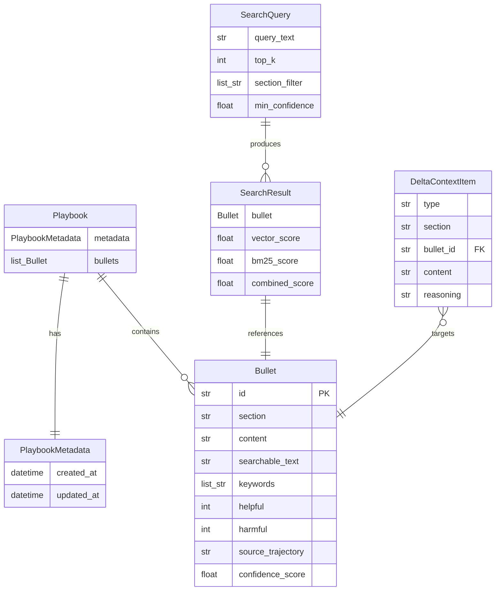

# Design Document: Self-Reflection System（基盤構築）

## Overview

ACE（Agentic Context Engineering）フレームワークに基づく自己内省システムの基盤を構築する.
本デザインでは、データモデル、Playbook永続化、ハイブリッド検索、LLMリクエスト基盤、DIコンテナ、LangGraphワークフロー基盤を設計する.
各エージェントの本格実装は次のスペックで行うが、本スペックではワークフローの骨格とLLMリクエストが動作する状態を目指す.

高度なDDDパターンは採用せず、シンプルな2層（application + components）+ common構成とする.
componentsは他に依存しない技術コンポーネントで、そのままコピペすれば動くレベルの独立性を持つ.
FastAPIは `src/main.py` に直接配置し、presentation層は設けない.

## Architecture

### ディレクトリ構成

```
src/
├── common/
│   ├── config/          # 設定ファイル読み込み、環境変数
│   │   ├── settings.py  # AppConfig等
│   │   └── section_loader.py  # セクション定義ローダー
│   ├── defs/            # 型定義、Enum、Pydanticモデル等の定義
│   ├── di/
│   │   └── container.py # dependency-injector DIコンテナ
│   ├── exceptions/      # カスタム例外
│   ├── lib/             # ロギング等、全体で使うユーティリティ
│   └── schema/
│       └── api.py       # APIリクエスト/レスポンススキーマ
├── components/          # 他に依存しない技術コンポーネント
│   ├── playbook_store/
│   │   ├── models.py    # Bullet, Playbook, DeltaContextItem等
│   │   └── store.py     # PlaybookStore（JSON永続化）
│   ├── hybrid_search/
│   │   ├── models.py    # SearchQuery, SearchResult
│   │   ├── embedding_client.py  # LangChain Embeddingsラッパー
│   │   └── search.py    # HybridSearch
│   └── llm_client/
│       └── client.py    # LLMClient（ファクトリ付き）
├── application/
│   ├── agents/          # Generator, Reflector, Curator（次スペック）
│   ├── workflows/
│   │   └── reflection_workflow.py  # LangGraphワークフロー
│   └── services/        # ユースケース（次スペック）
├── main.py              # FastAPIエントリポイント
└── gunicorn.conf.py     # Gunicorn設定
tests/                   # テストコード
config/                  # 設定ファイル（YAML等）
prompts/                 # プロンプトテンプレート
```

### 依存関係

```
components/（外部ライブラリのみに依存）
  ↑
application/（componentsをimport）
  ↑
common/（設定・DIを提供、components/applicationの両方から参照）
```

- `components/` は外部ライブラリ（Pydantic, LangChain, NumPy, rank-bm25）のみに依存
- `components/` は `application/` に依存しない
- `application/` は `components/` をimportしてビジネスロジックを組み立てる
- `common/` は設定とDIを提供する
- FastAPIは `src/main.py` に直接配置する（presentation層は設けない）

## Components and Interfaces

### 1. データモデル（components/playbook_store/models.py）

```python
from pydantic import BaseModel, Field, computed_field
from datetime import datetime
from typing import Literal

class Bullet(BaseModel):
    id: str
    section: str
    content: str
    searchable_text: str
    keywords: list[str] = Field(default_factory=list)
    helpful: int = 0
    harmful: int = 0
    source_trajectory: str = ""

    @computed_field
    @property
    def confidence_score(self) -> float:
        total = self.helpful + self.harmful
        if total == 0:
            return 0.5
        return self.helpful / total

class PlaybookMetadata(BaseModel):
    created_at: datetime = Field(default_factory=datetime.now)
    updated_at: datetime = Field(default_factory=datetime.now)

class Playbook(BaseModel):
    metadata: PlaybookMetadata = Field(default_factory=PlaybookMetadata)
    bullets: list[Bullet] = Field(default_factory=list)

class DeltaContextItem(BaseModel):
    type: Literal["ADD", "UPDATE", "DELETE"]
    section: str
    bullet_id: str | None = None
    content: str
    reasoning: str
```

### 2. PlaybookStore（components/playbook_store/store.py）

```python
import json
from pathlib import Path
from datetime import datetime

class PlaybookStore:
    """Playbookの永続化を担当するストア."""

    def __init__(self, data_dir: str = "data/playbooks") -> None:
        """初期化.

        Args:
            data_dir: Playbookファイルの保存ディレクトリ
        """
        self.data_dir = Path(data_dir)

    def load(self, dataset: str) -> Playbook:
        """指定データセットのPlaybookを読み込む.

        Args:
            dataset: データセット名

        Returns:
            Playbookオブジェクト. ファイルが存在しない場合は空のPlaybook.
        """
        path = self.data_dir / f"{dataset}.json"
        if not path.exists():
            return Playbook()
        data = json.loads(path.read_text())
        return Playbook.model_validate(data)

    def save(self, dataset: str, playbook: Playbook) -> None:
        """PlaybookをJSONファイルに保存する.

        Args:
            dataset: データセット名
            playbook: 保存するPlaybook
        """
        self.data_dir.mkdir(parents=True, exist_ok=True)
        path = self.data_dir / f"{dataset}.json"
        playbook.metadata.updated_at = datetime.now()
        path.write_text(playbook.model_dump_json(indent=2))
```

### 3. 検索モデル（components/hybrid_search/models.py）

```python
class SearchQuery(BaseModel):
    query_text: str
    top_k: int = 10
    section_filter: list[str] | None = None
    min_confidence: float = 0.3

class SearchResult(BaseModel):
    bullet: Bullet
    vector_score: float
    bm25_score: float
    combined_score: float
```

### 4. EmbeddingClient（components/hybrid_search/embedding_client.py）

```python
from langchain_core.embeddings import Embeddings

class EmbeddingClient:
    """LangChain Embeddingsモデルのラッパー."""

    def __init__(self, model: Embeddings) -> None:
        """初期化.

        Args:
            model: LangChainのEmbeddingsモデル
        """
        self.model = model

    def embed_query(self, text: str) -> list[float]:
        """クエリテキストのembeddingを生成する.

        Args:
            text: クエリテキスト

        Returns:
            embeddingベクトル
        """
        return self.model.embed_query(text)

    def embed_documents(self, texts: list[str]) -> list[list[float]]:
        """複数ドキュメントのembeddingを生成する.

        Args:
            texts: ドキュメントテキストのリスト

        Returns:
            embeddingベクトルのリスト
        """
        return self.model.embed_documents(texts)
```

### 5. HybridSearch（components/hybrid_search/search.py）

```python
import numpy as np
from rank_bm25 import BM25Okapi

class HybridSearch:
    """Numpyベクトル近傍探索とBM25を組み合わせたハイブリッド検索エンジン."""

    def __init__(self, embedding_client: EmbeddingClient, alpha: float = 0.5) -> None:
        """初期化.

        Args:
            embedding_client: embedding生成クライアント
            alpha: ベクトルスコアの重み（0〜1）
        """
        self.embedding_client = embedding_client
        self.alpha = alpha

    def search(self, query: SearchQuery, playbook: Playbook) -> list[SearchResult]:
        """ハイブリッド検索を実行する.

        Args:
            query: 検索クエリ
            playbook: 検索対象のPlaybook

        Returns:
            統合スコア降順のSearchResultリスト
        """
        if not playbook.bullets:
            return []

        candidates = self._filter_candidates(query, playbook.bullets)
        if not candidates:
            return []

        vector_scores = self._vector_search(query.query_text, candidates)
        bm25_scores = self._bm25_search(query.query_text, candidates)
        results = self._combine_scores(candidates, vector_scores, bm25_scores)

        results.sort(key=lambda r: r.combined_score, reverse=True)
        return results[:query.top_k]

    def _filter_candidates(self, query, bullets):
        candidates = bullets
        if query.section_filter:
            candidates = [b for b in candidates if b.section in query.section_filter]
        candidates = [b for b in candidates if b.confidence_score >= query.min_confidence]
        return candidates

    def _vector_search(self, query_text, candidates):
        query_embedding = np.array(self.embedding_client.embed_query(query_text))
        doc_embeddings = np.array(
            self.embedding_client.embed_documents([b.searchable_text for b in candidates])
        )
        norms = np.linalg.norm(doc_embeddings, axis=1) * np.linalg.norm(query_embedding)
        norms = np.where(norms == 0, 1, norms)
        scores = np.dot(doc_embeddings, query_embedding) / norms
        min_s, max_s = scores.min(), scores.max()
        if max_s > min_s:
            scores = (scores - min_s) / (max_s - min_s)
        else:
            scores = np.ones_like(scores) * 0.5
        return scores.tolist()

    def _bm25_search(self, query_text, candidates):
        corpus = [b.searchable_text.split() for b in candidates]
        bm25 = BM25Okapi(corpus)
        tokenized_query = query_text.split()
        scores = bm25.get_scores(tokenized_query)
        min_s, max_s = scores.min(), scores.max()
        if max_s > min_s:
            scores = (scores - min_s) / (max_s - min_s)
        else:
            scores = np.ones_like(scores) * 0.5
        return scores.tolist()

    def _combine_scores(self, candidates, vector_scores, bm25_scores):
        results = []
        for bullet, vs, bs in zip(candidates, vector_scores, bm25_scores):
            combined = self.alpha * vs + (1 - self.alpha) * bs
            results.append(SearchResult(
                bullet=bullet, vector_score=vs, bm25_score=bs, combined_score=combined
            ))
        return results
```

### 6. LLMClient（components/llm_client/client.py）

プロバイダ名を指定するだけでChatModelを出し分けるシンプルなファクトリ.

```python
import logging
from langchain_core.language_models import BaseChatModel
from langchain_core.messages import BaseMessage, AIMessage
from langchain_core.prompts import ChatPromptTemplate
from langchain_core.output_parsers import StrOutputParser

logger = logging.getLogger(__name__)

def create_chat_model(provider: str, model: str, **kwargs) -> BaseChatModel:
    """プロバイダ名からChatModelを生成するファクトリ.

    Args:
        provider: プロバイダ名（openai / bedrock / azure）
        model: モデル名

    Returns:
        ChatModelインスタンス

    Raises:
        ValueError: 未知のプロバイダが指定された場合
    """
    if provider == "openai":
        from langchain_openai import ChatOpenAI
        return ChatOpenAI(model=model, **kwargs)
    if provider == "bedrock":
        from langchain_aws import ChatBedrock
        return ChatBedrock(model_id=model, **kwargs)
    if provider == "azure":
        from langchain_openai import AzureChatOpenAI
        return AzureChatOpenAI(model=model, **kwargs)
    msg = f"Unknown provider: {provider}"
    raise ValueError(msg)

class LLMClient:
    """LangChain ChatModelを使用したLLMリクエストクライアント."""

    def __init__(self, chat_model: BaseChatModel) -> None:
        """初期化.

        Args:
            chat_model: LangChainのChatModel
        """
        self.chat_model = chat_model

    def invoke(self, messages: list[BaseMessage]) -> AIMessage:
        """メッセージリストでLLMにリクエストを送信する.

        Args:
            messages: メッセージリスト

        Returns:
            LLMの応答メッセージ
        """
        try:
            return self.chat_model.invoke(messages)
        except Exception:
            logger.exception("LLM request failed")
            raise

    def invoke_with_template(self, template: str, variables: dict[str, str]) -> str:
        """テンプレートを使用してLLMにリクエストを送信する.

        Args:
            template: プロンプトテンプレート
            variables: テンプレート変数

        Returns:
            LLMの応答文字列
        """
        try:
            prompt = ChatPromptTemplate.from_template(template)
            chain = prompt | self.chat_model | StrOutputParser()
            return chain.invoke(variables)
        except Exception:
            logger.exception("LLM request with template failed")
            raise
```

### 7. 設定管理（common/config/settings.py）

```python
from dataclasses import dataclass, field
import os

@dataclass
class LLMConfig:
    provider: str = "openai"
    model: str = "gpt-4o-mini"
    api_key: str = ""

@dataclass
class EmbeddingConfig:
    model: str = "text-embedding-3-small"
    api_key: str = ""

@dataclass
class PlaybookConfig:
    data_dir: str = "data/playbooks"

@dataclass
class SearchConfig:
    alpha: float = 0.5

@dataclass
class AppConfig:
    llm: LLMConfig = field(default_factory=LLMConfig)
    embedding: EmbeddingConfig = field(default_factory=EmbeddingConfig)
    playbook: PlaybookConfig = field(default_factory=PlaybookConfig)
    search: SearchConfig = field(default_factory=SearchConfig)

def load_config() -> AppConfig:
    return AppConfig(
        llm=LLMConfig(
            provider=os.getenv("LLM_PROVIDER", "openai"),
            model=os.getenv("LLM_MODEL", "gpt-4o-mini"),
            api_key=os.getenv("OPENAI_API_KEY", ""),
        ),
        embedding=EmbeddingConfig(
            model=os.getenv("EMBEDDING_MODEL", "text-embedding-3-small"),
            api_key=os.getenv("OPENAI_API_KEY", ""),
        ),
        playbook=PlaybookConfig(
            data_dir=os.getenv("PLAYBOOK_DATA_DIR", "data/playbooks"),
        ),
        search=SearchConfig(
            alpha=float(os.getenv("SEARCH_ALPHA", "0.5")),
        ),
    )
```

### 8. セクション定義ローダー（common/config/section_loader.py）

```python
from pydantic import BaseModel
from pathlib import Path
import yaml

class SectionDefinition(BaseModel):
    """セクション定義モデル."""

    name: str
    description: str

class SectionLoader:
    """YAML設定ファイルからセクション定義を読み込むローダー."""

    def __init__(self, config_path: str = "config/sections.yaml") -> None:
        """初期化.

        Args:
            config_path: セクション定義ファイルのパス
        """
        self.config_path = Path(config_path)

    def load(self, dataset: str) -> list[SectionDefinition]:
        """指定データセットのセクション定義を読み込む.

        Args:
            dataset: データセット名

        Returns:
            セクション定義のリスト
        """
        data = yaml.safe_load(self.config_path.read_text())
        sections = data.get(dataset, [])
        return [SectionDefinition(**s) for s in sections]
```

### 9. DIコンテナ（common/di/container.py）

```python
from dependency_injector import containers, providers
from langchain_openai import OpenAIEmbeddings

class Container(containers.DeclarativeContainer):
    config = providers.Configuration()

    chat_model = providers.Singleton(
        create_chat_model,
        provider=config.llm.provider,
        model=config.llm.model,
        api_key=config.llm.api_key,
    )

    embedding_model = providers.Singleton(
        OpenAIEmbeddings,
        model=config.embedding.model,
        api_key=config.embedding.api_key,
    )

    playbook_store = providers.Singleton(
        PlaybookStore,
        data_dir=config.playbook.data_dir,
    )

    embedding_client = providers.Singleton(
        EmbeddingClient,
        model=embedding_model,
    )

    hybrid_search = providers.Singleton(
        HybridSearch,
        embedding_client=embedding_client,
        alpha=config.search.alpha,
    )

    llm_client = providers.Singleton(
        LLMClient,
        chat_model=chat_model,
    )
```

### 10. LangGraphワークフロー基盤（application/workflows/reflection_workflow.py）

```python
from langgraph.graph import StateGraph, END
from typing import TypedDict

class WorkflowState(TypedDict):
    """ワークフローの状態定義."""

    query: str
    dataset: str
    playbook: Playbook | None
    search_results: list[SearchResult]
    llm_response: str | None

class ReflectionWorkflow:
    """LangGraphベースの内省ワークフロー."""

    def __init__(
        self,
        playbook_store: PlaybookStore,
        hybrid_search: HybridSearch,
        llm_client: LLMClient,
    ) -> None:
        """初期化.

        Args:
            playbook_store: Playbook永続化ストア
            hybrid_search: ハイブリッド検索エンジン
            llm_client: LLMリクエストクライアント
        """
        self.playbook_store = playbook_store
        self.hybrid_search = hybrid_search
        self.llm_client = llm_client

    def build(self) -> CompiledStateGraph:
        """ワークフローグラフを構築・コンパイルする.

        Returns:
            コンパイル済みStateGraph
        """
        graph = StateGraph(WorkflowState)
        graph.add_node("load_playbook", self._load_playbook)
        graph.add_node("search", self._search)
        graph.add_node("generate", self._generate)
        graph.set_entry_point("load_playbook")
        graph.add_edge("load_playbook", "search")
        graph.add_edge("search", "generate")
        graph.add_edge("generate", END)
        return graph.compile()

    def _load_playbook(self, state: WorkflowState) -> dict:
        playbook = self.playbook_store.load(state["dataset"])
        return {"playbook": playbook}

    def _search(self, state: WorkflowState) -> dict:
        query = SearchQuery(query_text=state["query"])
        results = self.hybrid_search.search(query, state["playbook"])
        return {"search_results": results}

    def _generate(self, state: WorkflowState) -> dict:
        context = "\n".join(r.bullet.content for r in state["search_results"])
        template = "Context:\n{context}\n\nQuery: {query}\n\nAnswer:"
        response = self.llm_client.invoke_with_template(
            template, {"context": context, "query": state["query"]}
        )
        return {"llm_response": response}
```

PoCフェーズでは load_playbook → search → generate の3ノード構成.
次のスペックでReflector, Curatorノードを追加する.

### 11. FastAPIアプリケーション（src/main.py）

APIリクエスト/レスポンスのスキーマは `common/schema/api.py` に配置する.
FastAPIのエントリポイントは `src/main.py` に直接配置し、presentation層は設けない.

```python
# common/schema/api.py
from pydantic import BaseModel

class WorkflowRequest(BaseModel):
    """ワークフロー実行リクエスト."""

    query: str
    dataset: str = "appworld"

class WorkflowResponse(BaseModel):
    """ワークフロー実行レスポンス."""

    llm_response: str
    search_results_count: int

# src/main.py
from fastapi import FastAPI
from common.di.container import Container
from common.schema.api import WorkflowRequest, WorkflowResponse

def create_app() -> FastAPI:
    """FastAPIアプリケーションを生成する.

    Returns:
        FastAPIインスタンス
    """
    app = FastAPI(title="Self-Reflection System")
    container = Container()
    app.container = container
    return app

app = create_app()

@app.get("/health")
def health():
    return {"status": "ok"}

@app.post("/workflow/run", response_model=WorkflowResponse)
def run_workflow(request: WorkflowRequest):
    ...
```

Docker + docker-composeでUvicorn起動する構成.

## Data Models

### エンティティ関係図



### JSON保存形式（Playbook）

```json
{
  "metadata": {
    "created_at": "2025-01-01T00:00:00",
    "updated_at": "2025-01-01T00:00:00"
  },
  "bullets": [
    {
      "id": "shr-00001",
      "section": "strategies_and_hard_rules",
      "content": "時間に敏感なトランザクションでは...",
      "searchable_text": "時間 トランザクション 日時範囲...",
      "keywords": ["datetime", "range", "transaction"],
      "helpful": 5,
      "harmful": 0,
      "source_trajectory": "traj_fail_042 -> traj_success_043"
    }
  ]
}
```

## Correctness Properties

*プロパティとは、システムの全ての有効な実行において成り立つべき特性や振る舞いのこと. 人間が読める仕様と機械的に検証可能な正しさの保証を橋渡しする形式的な記述である.*

### Property 1: Pydanticモデルのフィールド保持

*For any* 有効なフィールド値の組み合わせで生成されたBullet, Playbook, DeltaContextItem, SearchQuery, SearchResultにおいて、各フィールドの値が入力値と一致すること.

**Validates: Requirements 1.1, 1.3, 1.4, 1.5, 1.6**

### Property 2: confidence_scoreの正しい計算

*For any* 非負整数のhelpfulとharmfulを持つBulletにおいて、helpful + harmful > 0の場合はconfidence_scoreがhelpful / (helpful + harmful)と等しく、helpful + harmful == 0の場合はconfidence_scoreが0.5であること.

**Validates: Requirements 1.2**

### Property 3: Playbookシリアライゼーションのラウンドトリップ

*For any* 有効なPlaybookオブジェクトにおいて、PlaybookStoreでJSON保存した後に読み込んだPlaybookが元のPlaybookと等価であること（updated_atの更新を除く）.

**Validates: Requirements 2.1, 2.2, 2.3**

### Property 4: ハイブリッド検索のスコア統合

*For any* 0〜1のvector_scoreとbm25_score、および0〜1のαにおいて、統合スコアがα * vector_score + (1-α) * bm25_scoreと等しいこと.

**Validates: Requirements 4.3**

### Property 5: 検索結果のフィルタリング

*For any* section_filterとmin_confidenceが指定された検索クエリにおいて、返却される全てのSearchResultのBulletが指定セクションに属し、かつconfidence_scoreがmin_confidence以上であること.

**Validates: Requirements 4.4, 4.5**

### Property 6: 検索結果のソートとtop_k制約

*For any* 検索クエリの結果において、SearchResultリストがcombined_scoreの降順でソートされており、かつリストの長さがtop_k以下であること.

**Validates: Requirements 4.6**

## Error Handling

### LLMリクエストエラー

- LLMへのリクエストが失敗した場合（タイムアウト、認証エラー、レート制限等）、エラー情報をログに記録し、呼び出し元に例外を伝播する
- PoCフェーズではリトライ機構は実装しない

### ファイルI/Oエラー

- PlaybookのJSON読み込み時にファイルが破損している場合、パースエラーをログに記録し例外を送出する
- ファイルが存在しない場合は空のPlaybookを返却する（正常系として処理）

### 検索エラー

- embedding生成が失敗した場合、エラーをログに記録し例外を送出する
- Playbookが空の場合は空のリストを返却する（正常系として処理）

### 設定エラー

- 必須の環境変数（OPENAI_API_KEY等）が未設定の場合、起動時にエラーメッセージを表示して終了する

## Testing Strategy

### PoCフェーズの方針

現在はPoCフェーズであり、テストコードは基本不要. 書く場合も最低限にとどめる.
動作確認は手動実行やスクリプトベースで十分とする.

### テストコードの配置

テストを書く場合は以下の方針に従う:
- テストコードは `tests/` ディレクトリに配置する（`src/` 内には置かない）
- テストファイル名は `test_<対象モジュール名>.py` とする
- テストフレームワークは pytest を使用する
- 極力 `pytest.mark.parametrize` でテストケースを共通化する

### プロパティベーステスト（任意）

将来的にテストを追加する場合、以下のライブラリを使用する:
- **pytest**: テストフレームワーク
- **hypothesis**: プロパティベーステストライブラリ
- 各プロパティテストは最低100回のイテレーションで実行

### テスト対象の優先度

PoCフェーズで最低限確認すべき項目:
1. データモデルの生成・バリデーション → 手動実行で確認
2. Playbookの保存・読み込み → 手動実行で確認
3. ハイブリッド検索の動作 → 手動実行で確認
4. LLMリクエストの送信・応答取得 → 手動実行で確認
5. ワークフローの一連の実行 → 手動実行で確認

### プロパティテストのタグ形式

テストを書く場合、各テストに以下のコメントを付与する:
```python
# Feature: self-reflection-system, Property N: {property_text}
```
