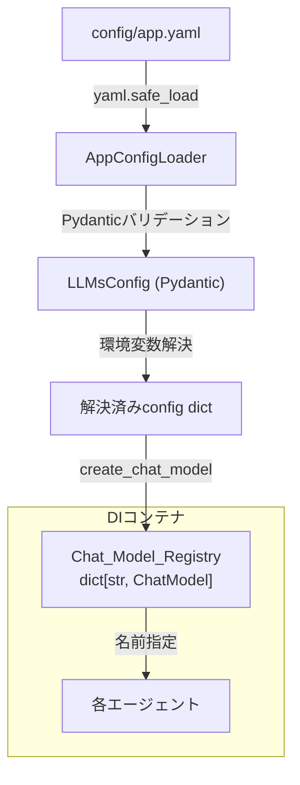

# 設計書: YAML LLMクライアント設定

## 概要

`config/app.yaml` にYAML形式でLLMクライアント設定を定義し、Pydanticモデルでバリデーションした上で、DIコンテナから名前ベースで複数のChatModelインスタンスを解決できる仕組みを構築する.

現在の構成では単一の `LLMConfig`（provider, model, api_key）から1つの `chat_model` Singletonを生成しているが、本設計では複数プロバイダ・複数モデルをYAMLで宣言的に定義し、名前をキーとしたレジストリパターンで管理する.

## アーキテクチャ



データの流れ:
1. `config/app.yaml` をYAML_Loaderが読み込む
2. Pydanticモデル（LLM_Config_Schema）でバリデーション
3. `_env` サフィックスフィールドの環境変数を解決
4. 既存の `create_chat_model` ファクトリでChatModelインスタンスを生成
5. Chat_Model_Registryに名前をキーとして登録
6. DIコンテナ経由で名前指定でインスタンスを取得

## コンポーネントとインターフェース

### 1. Pydanticスキーマ (`src/common/schema/llm_config.py`)

YAML設定の構造を定義するPydanticモデル群.

```python
from pydantic import BaseModel, Field
from typing import Any


class ChatClientEntry(BaseModel):
    """個別のLLMクライアント定義."""
    name: str
    config: dict[str, Any]
    default_params: dict[str, Any] = Field(default_factory=dict)


class ChatClientsConfig(BaseModel):
    """プロバイダ別クライアント定義."""
    bedrock: list[ChatClientEntry] = Field(default_factory=list)
    azure: list[ChatClientEntry] = Field(default_factory=list)
    openai: list[ChatClientEntry] = Field(default_factory=list)


class LLMsConfig(BaseModel):
    """LLMs設定のルート."""
    chat_clients: ChatClientsConfig


class AppYamlConfig(BaseModel):
    """app.yaml全体のルートモデル."""
    llms: LLMsConfig
```

設計判断:
- `config` フィールドは `dict[str, Any]` とする. プロバイダごとにフィールドが異なるため、厳密な型定義よりも柔軟性を優先する. バリデーションは `create_chat_model` ファクトリ側で行われる.
- `ChatClientsConfig` でプロバイダ名をフィールドとして明示的に定義する. これにより、未知のプロバイダが混入した場合にPydanticがバリデーションエラーを出す.
- `default_params` はオプショナルで空辞書がデフォルト.

### 2. YAML_Loader (`src/common/config/app_config_loader.py`)

既存の `SectionLoader` と同様のパターンで、`config/app.yaml` を読み込む.

```python
from pathlib import Path
import os
import yaml
from src.common.schema.llm_config import AppYamlConfig


class AppConfigLoader:
    """app.yaml設定ファイルを読み込むローダー."""

    def __init__(self, config_path: str = "config/app.yaml") -> None:
        self.config_path = Path(config_path)

    def load(self) -> AppYamlConfig:
        """YAMLを読み込みPydanticモデルに変換する."""
        if not self.config_path.exists():
            raise FileNotFoundError(f"設定ファイルが見つからない: {self.config_path}")
        data = yaml.safe_load(self.config_path.read_text())
        return AppYamlConfig(**data)
```

環境変数解決ロジック:

```python
def resolve_env_vars(config: dict[str, Any]) -> dict[str, Any]:
    """_envサフィックスのフィールドを環境変数で解決する."""
    resolved = {}
    for key, value in config.items():
        if key.endswith("_env"):
            resolved_key = key[:-4]  # "_env" を除去
            resolved[resolved_key] = os.getenv(str(value))
        else:
            resolved[key] = value
    return resolved
```

設計判断:
- 環境変数解決は `_env` サフィックスの規約ベース. 明示的で分かりやすい.
- 未設定の環境変数は `None` を返す. bedrockのように環境変数不要なプロバイダに対応するため.
- `resolve_env_vars` は独立した関数として定義し、テスト容易性を確保する.

### 3. Chat_Model_Registry構築 (`src/common/config/app_config_loader.py` 内)

```python
from langchain_core.language_models import BaseChatModel
from src.components.llm_client.client import create_chat_model


def build_chat_model_registry(app_config: AppYamlConfig) -> dict[str, BaseChatModel]:
    """AppYamlConfigから全ChatModelインスタンスを生成しレジストリを構築する."""
    registry: dict[str, BaseChatModel] = {}
    for provider, entries in _iter_provider_entries(app_config):
        for entry in entries:
            resolved_config = resolve_env_vars(entry.config)
            params = {k: v for k, v in entry.default_params.items() if v is not None}
            model = create_chat_model(provider=provider, model=resolved_config.pop("model", resolved_config.pop("model_id", "")), **resolved_config, **params)
            registry[entry.name] = model
    return registry


def _iter_provider_entries(app_config: AppYamlConfig):
    """プロバイダ名とエントリリストのペアをイテレートする."""
    clients = app_config.llms.chat_clients
    yield "bedrock", clients.bedrock
    yield "azure", clients.azure
    yield "openai", clients.openai
```

設計判断:
- bedrockは `model_id`、openai/azureは `model` をキーとして使う. `resolved_config` から適切なキーをpopして `create_chat_model` の `model` 引数に渡す.
- `default_params` の `None` 値はフィルタリングして除外する（要件6.2）.
- レジストリは単純な `dict[str, BaseChatModel]` で十分. 名前の一意性はYAML定義側の責任.

### 4. DIコンテナ拡張 (`src/common/di/container.py`)

```python
class Container(containers.DeclarativeContainer):
    config = providers.Configuration()

    # 新規: YAML設定ローダー
    app_config_loader = providers.Singleton(AppConfigLoader)
    app_yaml_config = providers.Singleton(lambda loader: loader.load(), app_config_loader)

    # 新規: ChatModelレジストリ
    chat_model_registry = providers.Singleton(build_chat_model_registry, app_yaml_config)

    # 既存互換: 単一chat_model（後方互換性のため維持）
    chat_model = providers.Singleton(
        create_chat_model,
        provider=config.llm["provider"],
        model=config.llm["model"],
        api_key=config.llm["api_key"],
    )

    # 既存互換: 単一llm_client
    llm_client = providers.Singleton(LLMClient, chat_model=chat_model)

    # ... 既存のエージェント定義はそのまま維持
```

名前ベースでのクライアント取得:

```python
def get_chat_model(self, name: str) -> BaseChatModel:
    """名前を指定してChatModelを取得する."""
    registry = self.chat_model_registry()
    if name not in registry:
        available = list(registry.keys())
        raise KeyError(f"ChatModel '{name}' が見つからない. 利用可能: {available}")
    return registry[name]

def get_llm_client(self, name: str) -> LLMClient:
    """名前を指定してLLMClientを取得する."""
    return LLMClient(chat_model=self.get_chat_model(name))
```

設計判断:
- 既存の `chat_model` / `llm_client` プロバイダはそのまま維持し、後方互換性を確保する.
- 新しいレジストリベースの取得は `get_chat_model` / `get_llm_client` メソッドで提供する.
- レジストリ自体はSingletonで、一度構築されたら再利用される.

## データモデル

### YAML設定構造

```yaml
llms:
  chat_clients:
    bedrock:
      - name: "sonnet"           # 一意な識別名
        config:
          model_id: "..."        # Bedrock固有: モデルID
          region_name: "..."     # Bedrock固有: リージョン
        default_params:
          max_tokens: 1024
    azure:
      - name: "gpt-4o"
        config:
          model: "..."           # Azure固有: モデル名
          azure_deployment: "..."
          azure_endpoint_env: "AZURE_OPENAI_ENDPOINT"  # _env → 環境変数参照
          api_key_env: "AZURE_OPENAI_API_KEY"
          openai_api_version: "..."
        default_params:
          temperature: 0.5
    openai:
      - name: "..."
        config:
          model: "..."
          api_key_env: "OPENAI_API_KEY"
        default_params: {}
```

### Pydanticモデル階層

```
AppYamlConfig
└── llms: LLMsConfig
    └── chat_clients: ChatClientsConfig
        ├── bedrock: list[ChatClientEntry]
        ├── azure: list[ChatClientEntry]
        └── openai: list[ChatClientEntry]

ChatClientEntry
├── name: str
├── config: dict[str, Any]
└── default_params: dict[str, Any] = {}
```

### Chat_Model_Registry

```
dict[str, BaseChatModel]
{
    "sonnet": ChatBedrock(...),
    "haiku": ChatBedrock(...),
    "gpt-4o": AzureChatOpenAI(...),
    "gpt-4.1": AzureChatOpenAI(...),
    ...
}
```

## 正当性プロパティ

*プロパティとは、システムの全ての有効な実行において成り立つべき特性や振る舞いのことである. 人間が読める仕様と機械的に検証可能な正当性保証の橋渡しとなる.*

### Property 1: YAML設定のラウンドトリップ

*任意の*有効な `AppYamlConfig` オブジェクトに対して、YAMLに書き出してから読み込み・バリデーションすると、元のオブジェクトと同等のインスタンスが得られる.

**Validates: Requirements 3.1**

### Property 2: 有効な設定のバリデーション通過

*任意の*有効な構造（name: str, config: dict, default_params: dict）を持つChat_Client_Entryに対して、Pydanticバリデーションが成功し、全フィールドが保持される.

**Validates: Requirements 1.2, 2.2, 2.4**

### Property 3: 不正な設定のバリデーション拒否

*任意の*必須フィールド（name）が欠落したデータに対して、Pydanticバリデーションが `ValidationError` を発生させる.

**Validates: Requirements 2.3**

### Property 4: 環境変数解決とキー名変換

*任意の*config dictに対して、`_env` サフィックスを持つキーは環境変数値に解決され、解決後のキー名からサフィックスが除去される. `_env` サフィックスを持たないキーは変更されない.

**Validates: Requirements 4.1, 4.3**

### Property 5: レジストリへの全エントリ登録

*任意の*有効な `AppYamlConfig` に対して、全プロバイダの全 `ChatClientEntry` の `name` がレジストリのキーとして存在し、レジストリのサイズは全エントリ数と一致する.

**Validates: Requirements 5.1, 5.2**

### Property 6: レジストリのSingleton性

*任意の*登録済みname に対して、レジストリから2回取得したインスタンスは同一オブジェクト（`is` で比較）である.

**Validates: Requirements 5.4**

### Property 7: Noneパラメータのフィルタリング

*任意の*default_params dictに対して、None値を持つキーはフィルタリング後の結果に含まれない. None以外の値を持つキーは全て保持される.

**Validates: Requirements 6.2**

## エラーハンドリング

| エラー状況 | 発生箇所 | 例外型 | メッセージ内容 |
|---|---|---|---|
| YAMLファイルが存在しない | AppConfigLoader.load() | FileNotFoundError | ファイルパスを含む |
| YAML構文エラー | AppConfigLoader.load() | yaml.YAMLError | PyYAMLのデフォルトメッセージ |
| スキーマバリデーション失敗 | AppYamlConfig(**data) | pydantic.ValidationError | 不正フィールドの詳細 |
| 存在しないname指定 | Container.get_chat_model() | KeyError | 指定name + 利用可能name一覧 |
| 未知のプロバイダ | create_chat_model() | ValueError | プロバイダ名（既存動作） |

## テスト戦略

### テストフレームワーク

- **ユニットテスト**: pytest + pytest-asyncio
- **プロパティベーステスト**: Hypothesis（Python向けPBTライブラリ）
- 各プロパティテストは最低100イテレーション実行する

### テスト方針

PoCフェーズのため、テストは最低限にとどめる. ただし、以下の観点でテストを書く:

**プロパティベーステスト**:
- `resolve_env_vars` 関数の環境変数解決ロジック（Property 4）
- Pydanticモデルのバリデーション（Property 2, 3）
- YAML設定のラウンドトリップ（Property 1）
- Noneフィルタリング（Property 7）

**ユニットテスト**:
- AppConfigLoaderのファイル不在エラー（edge-case: 3.2）
- 存在しないnameでのKeyError（edge-case: 5.3）
- default_params省略時のデフォルト値（edge-case: 2.5）
- プロバイダ別の設定例（example: 1.3, 1.4, 1.5）

### テストタグ形式

各プロパティテストには以下のコメントを付与する:
```python
# Feature: yaml-llm-config, Property N: {property_text}
```

### テストファイル配置

```
tests/
└── test_llm_config.py    # スキーマ・ローダー・レジストリのテスト
```
