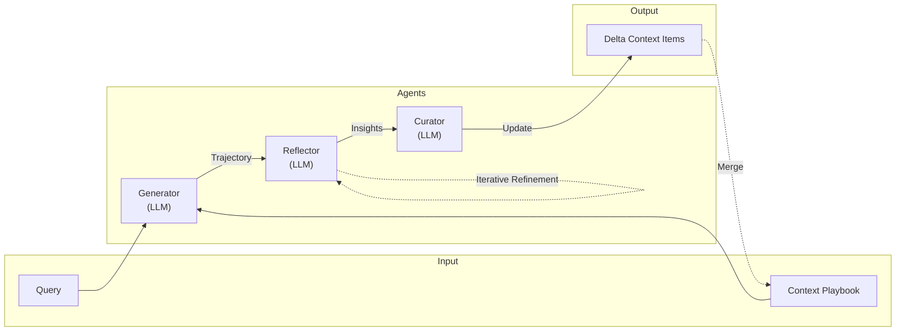

# 自己内省（self-reflection）

エージェントの自己内省の仕組みを構築する。

## エージェント
- generator-agent: 推論用エージェント. ここは今後別のに置き換わるかも.
- reflection-agent: 自己内省用エージェント
- curation-agent: キュレーション用エージェント

## 技術
- AutoGen
- agent-lightning
- LangGraph: 各エージェントはノードで表現し、ワークフローを使って各エージェントを接続する。一旦は検証用で同じ環境に開発するため。
- LangChain: LLMへのリクエスト処理はLangChainを使用する。


## Linter

- ruff を使用
- ./ruff.toml に従う


## 以下は可変にして、他のデータでも検証できるようにする。
- 推論などのプロンプトへの挿入箇所
- 正解不正解の判定ロジック

---

# 設計参考情報（ACE論文に基づく）

## 概要

本システムは**ACE（Agentic Context Engineering）フレームワーク**を参考に構築する。
ACEは、LLMが推論中に得た経験から学び、Playbookとして知識を蓄積・改善するための自己内省アーキテクチャ。

## アーキテクチャ概要



### 3つのエージェントの役割

| Agent | 役割 | 入力 | 出力 |
|-------|------|------|------|
| **Generator** | タスク実行・推論を行う | Query + Playbook | Trajectory（推論過程） |
| **Reflector** | 成功/失敗を分析し、教訓を抽出 | Trajectory + Ground Truth + Test Report | Insights（洞察） |
| **Curator** | 洞察をPlaybookに統合・整理 | Insights + Current Playbook | Delta Context Items（更新差分） |

---

### 用語整理: PlaybookとInsightsの関係

```
                    ACEアーキテクチャにおけるデータフロー
                    
Generator → Trajectory → Reflector → Insights → Curator → Delta Items → Playbook
                              ↑                                            ↓
                              |                                            |
                         （中間生成物）                              （最終保存形式）
                          保存しない                                  Bulletとして保存
```

| 用語 | 役割 | 保存 |
|------|------|------|
| **Playbook** | 知識ベース全体（Bulletのコンテナ） | ○ JSON/YAML |
| **Bullet** | 個別の知識単位（Playbookの要素） | ○ JSON |
| **Insights** | Reflectorの分析結果（中間生成物） | × Bulletに変換 |
| **Delta Items** | Curatorが生成する更新差分 | × Playbookにマージ |

> **注意**: ACEの「Insights」はAutoManual研究の「Insight」とは異なる。
> - ACE: Reflectorの出力（中間生成物、Bulletに変換される）
> - AutoManual: 最終保存形式（type, applicability_context等を持つ）

---

### 本プロジェクトの方針

**ACEをベースにしつつ、以下をカスタマイズ:**

| 項目 | ACE論文 | 本プロジェクト |
|------|---------|----------------|
| **Playbook注入** | 全体を注入 | ハイブリッド検索で関連Bulletのみ注入 |
| **検索方式** | なし | Numpy近傍 + BM25 |
| **Section定義** | 固定（3セクション） | 設定ファイルでデータセット別に定義可能 |
| **保存形式** | 記載なし | JSON（embedding別管理） |

---

### ACE vs 他研究（AutoManual/H²R）の比較

| 項目 | ACE | AutoManual/H²R |
|------|-----|----------------|
| **知識単位** | Bullet（シンプル） | Insight（詳細メタデータ） |
| **分類** | section（表示用） | type（性質分類用） |
| **検索** | 全部注入 + LLMに選ばせる | applicability_contextでベクトル検索 |
| **階層** | なし | High-level / Low-level |
| **採用理由** | シンプル、実装容易 | ― |

**将来拡張時**: Bulletにtype, applicability_context, hierarchical_levelを追加することで、AutoManual/H²R相当のInsight形式に拡張可能。

---

## データモデル

### Playbook（コンテキスト知識ベース）

> **方針**: ACEをベースにするが、Playbook全体注入は重いため**ハイブリッド検索**を実装。
> 検索は **Numpyベクトル近傍探索 + BM25全文検索** のハイブリッドで実装予定。

**ファイル管理:**
```
data/playbooks/
├── appworld.json        # AppWorld用Playbook
├── alfworld.json        # ALFWorld用Playbook
└── custom.json          # カスタムデータセット用
```

```yaml
# Playbookの構造例（appworld.json）
playbook:
  metadata:
    created_at: "2026-02-09"
    updated_at: "2026-02-09"
  sections:
    - name: "strategies_and_hard_rules"
      bullets: [...]
    - name: "useful_code_snippets_and_templates"
      bullets: [...]
    - name: "troubleshooting_and_pitfalls"
      bullets: [...]
```

> **注**: datasetはフィールドで管理せず、**ファイル単位で分離**する。

---

### Section（セクション定義）

**セクションはタスクやデータセットによって変わる**ため、設定ファイルで定義可能にする。

```yaml
# config/sections.yaml - セクション定義（データセット別）
appworld:
  - name: "strategies_and_hard_rules"
    description: "戦略・ハードルール"
  - name: "useful_code_snippets_and_templates"
    description: "再利用可能なコードスニペット"
  - name: "troubleshooting_and_pitfalls"
    description: "トラブルシューティング・注意点"
  - name: "api_usage_patterns"
    description: "API使用パターン"

alfworld:
  - name: "navigation_strategies"
    description: "ナビゲーション戦略"
  - name: "object_interaction_rules"
    description: "オブジェクト操作ルール"
  - name: "common_failure_patterns"
    description: "よくある失敗パターン"

custom:
  - name: "domain_knowledge"
    description: "ドメイン固有知識"
  - name: "best_practices"
    description: "ベストプラクティス"
  - name: "error_recovery"
    description: "エラー回復策"
```

---

### Bullet（知識の単位）- ACEベース + 検索対応

```python
@dataclass
class Bullet:
    # === 識別・分類 ===
    id: str                    # 一意識別子（例: "shr-00001"）
    section: str               # セクション名（設定ファイルで定義）
    
    # === 内容 ===
    content: str               # 知識の内容（教訓・ルール）
    
    # === 検索用フィールド ===
    searchable_text: str       # 検索対象テキスト（content + keywords結合）
    keywords: list[str]        # BM25用キーワード（手動または自動抽出）
    # ※ embeddingはJSONに含めず、検索インデックス構築時に生成
    
    # === 評価メトリクス ===
    helpful: int = 0           # 有用とマークされた回数（UPVOTE）
    harmful: int = 0           # 有害とマークされた回数（DOWNVOTE）
    
    # === トレーサビリティ（オプション） ===
    source_trajectory: str = ""  # 生成元の軌跡ID（失敗→成功の対比）
    
    @property
    def confidence_score(self) -> float:
        """helpful/harmfulから信頼度スコアを計算"""
        total = self.helpful + self.harmful
        if total == 0:
            return 0.5
        return self.helpful / total
```

```json
// 具体例（JSON保存形式）
{
  "id": "shr-00001",
  "section": "strategies_and_hard_rules",
  "content": "時間に敏感なトランザクションでは、文字列マッチングではなく日時範囲を使用する",
  "searchable_text": "時間 トランザクション 日時範囲 datetime range 文字列マッチング",
  "keywords": ["datetime", "range", "transaction", "時間", "日時"],
  "helpful": 5,
  "harmful": 0,
  "source_trajectory": "traj_fail_042 -> traj_success_043"
}
```

> **embeddingの管理方針:**
> - JSONには含めない（サイズが大きいため）
> - 検索インデックス構築時に`searchable_text`からembedding生成
> - Numpy配列としてpickleで別ファイル保存（例: `playbook_embeddings.pkl`）
> - BM25インデックスも同様に別ファイル管理

---

### 検索仕様

```python
@dataclass
class SearchQuery:
    query_text: str            # 検索クエリ（自然言語）
    top_k: int = 10            # 取得件数
    section_filter: list[str] = None  # セクションでフィルタ（オプション）
    min_confidence: float = 0.3       # 最低信頼度

@dataclass
class SearchResult:
    bullet: Bullet
    vector_score: float        # ベクトル類似度（0〜1）
    bm25_score: float          # BM25スコア
    combined_score: float      # ハイブリッドスコア
```

**ハイブリッド検索の流れ:**
```
1. query_text → embedding生成
2. Numpy近傍探索で上位N件取得（vector_score）
3. BM25でkeywords/searchable_textを検索（bm25_score）
4. スコア統合: combined = α * vector_score + (1-α) * bm25_score
5. section_filter, min_confidenceでフィルタ
6. top_k件を返却
```

---

### 参考: Insightフォーマット（AutoManual/H²R研究ベース）

将来的に拡張する場合の参考フォーマット。現在は採用しない。

```python
@dataclass
class Insight:
    insight_id: str
    content: str
    type: Literal["Success Process", "Corrected Error", "Useful Helper Method", "Unsolved Error"]
    applicability_context: str           # 検索用コンテキスト
    hierarchical_level: Literal["High-level Planning", "Low-level Execution"]
    source_trajectory: str
    metadata: InsightMetadata
```

---

### Insightフィールドの詳細解説

#### 1. `type`: 洞察のカテゴリ

その知識が「どういう性質のものか」を分類するためのタグ。AutoManualの研究に基づく。

| Type | 意味 | 例 |
|------|------|-----|
| **Success Process** | 特定のタスクを成功させる「正解ルート」「手順書」 | 「アイテムを加熱するには、電子レンジを探し→持ち→開け→入れ→閉め→起動」 |
| **Corrected Error** | 失敗した経験と、修正による成功策（失敗からの回復策） | 「冷蔵庫を開けずに物を取ろうとして失敗→物を取る前は必ず『Open』が必要」 |
| **Useful Helper Method** | 複数タスクで再利用可能な汎用コードスニペット/サブルーチン | 「ページをめくって検索結果を探索する」共通関数 |
| **Unsolved Error** | 現在解決できないが将来のために記録する「注意喚起」 | 解決策未発見のエッジケース |

#### 2. `applicability_context`: 適用可能なコンテキスト

その洞察を「いつ」検索・使用すべきかを定義。検索精度向上のための重要メタデータ。

- **意味**: ルール/戦略が有効になる「前提条件」「状況」の記述
- **役割**: 新タスク直面時に、このコンテキストと現在状況の類似度（ベクトル検索等）を計算し、マッチするものだけを検索
- **例**:
  - 「科学実験タスクで温度測定が必要な場合」
  - 「ユーザーから曖昧な検索クエリを受け取った場合」
  - 「調理器具が近くにない状態での食材加工タスク」

#### 3. `hierarchical_level`: 階層レベル

知識が「戦略（全体計画）」か「戦術（具体的動作）」かを区別。H²Rフレームワークに基づく2層構造。

| Level | 意味 | 例 |
|-------|------|-----|
| **High-level (Planning)** | タスク全体をサブゴールに分解する「計画」の知識 | 「カクテル作成: 1.グラス準備→2.材料収集→3.混合」 |
| **Low-level (Execution)** | サブゴール達成の「操作手順」「アクション」。環境依存性高 | 「Grasp失敗時→位置調整後に再試行」 |

**この区別の利点**: 「計画は正しいが操作でミス」vs「そもそも計画が間違い」を切り分けて学習可能

#### 4. `source_trajectory`: 参照元となる軌跡

洞察が得られるきっかけとなった「具体的な体験ログ（証拠）」へのリンク。

- **意味**: 失敗した行動履歴（Failed Trajectory）と成功した行動履歴（Successful Trajectory）のペアまたはID
- **役割**:
  - **根拠の明示**: ルールが生まれた理由を後から検証（Verify）
  - **対比学習（Contrastive Learning）**: ExpeLやAutoRefineで成功/失敗を比較し「決定的な違い」を分析
- **例**: `traj_fail_001`（熱い鍋を素手で触り火傷） → `traj_success_002`（ミトンで鍋移動し成功）

#### 5. `confidence_score`: 信頼度スコア

洞察の「信頼度」「有用性」を表す数値。動的に変動する。

| 操作 | トリガー | 効果 |
|------|----------|------|
| **UPVOTE（加点）** | ルール使用で成功 | スコア上昇 |
| **DOWNVOTE（減点）** | ルール使用で失敗/誤解を招いた | スコア低下 |
| **Pruning（剪定）** | スコアが閾値以下、または使用頻度高いが成功率低い | メモリから自動削除 |

**役割**: 質の低いルールでメモリが溢れるのを防ぎ、「ベストプラクティス」だけを残すフィルタリング機能

---


```python
@dataclass
class DeltaContextItem:
    type: Literal["ADD", "UPDATE", "DELETE"]
    section: str
    bullet_id: Optional[str]   # UPDATE/DELETEの場合
    content: str               # 新しい/更新内容
    reasoning: str             # この変更を行う理由
```

## 処理フロー

### 1. Generator フェーズ

```
入力:
  - Query（タスク）
  - Playbook（現在の知識）

処理:
  1. Playbookを読み込み
  2. 関連する戦略・コードスニペットを参照
  3. タスクを実行
  4. 推論過程（Trajectory）を記録

出力:
  - Generated Code/Answer
  - Reasoning Trajectory
```

### 2. Reflector フェーズ

```
入力:
  - Ground Truth Code（正解コード）
  - Generated Code（生成コード）
  - Test Report（テスト結果）
  - Current Playbook

処理:
  1. 正解と生成結果を比較
  2. エラーの根本原因を分析
  3. 以下を抽出:
     - reasoning: 思考過程
     - error_identification: 何が間違っていたか
     - root_cause_analysis: なぜエラーが発生したか
     - correct_approach: 正しいアプローチ
     - key_insight: 覚えるべき教訓
  4. Playbookの各bulletに対してタグ付け（helpful/harmful/neutral）

出力:
  - Insights（JSON形式）
  - Bullet評価タグ
```

### 3. Curator フェーズ

```
入力:
  - Reflector の Insights
  - Current Playbook

処理:
  1. 新しい洞察を既存Playbookと照合
  2. 重複を排除
  3. 追加すべき新知識を特定
  4. Delta操作を決定:
     - ADD: 新しいbulletを追加
     - UPDATE: 既存bulletを更新
     - DELETE: 不要なbulletを削除

出力:
  - Delta Context Items
  - Updated Playbook
```

## 主要メカニズム

### Incremental Delta Updates（差分更新）
- Playbookを一枚岩のプロンプトではなく、構造化されたbulletの集合として扱う
- 各bulletにはID、helpful/harmfulカウンターを持つ
- 細かい粒度での追加・更新・削除が可能

### Grow-and-Refine（成長と洗練）
- 新しいbulletは追加、既存bulletはカウンター更新
- 定期的に重複削除・統合を実行
- semantic embeddingで類似bulletを検出

### Iterative Refinement（反復改善）
- Reflectorでの分析を複数回繰り返すオプション
- より深い洞察を得るための反復ループ

## 開発すべきコンポーネント

### 必須コンポーネント

1. **PlaybookStore**
   - Playbookの永続化・読み込み
   - YAML/JSON形式でのシリアライズ

2. **GeneratorAgent**
   - LangChainを使用したLLM呼び出し
   - Playbookをコンテキストとして注入
   - Trajectoryの記録

3. **ReflectorAgent**
   - 正解との比較分析
   - Insights抽出
   - Bullet評価

4. **CuratorAgent**
   - InsightsからDelta生成
   - Playbookへのマージ
   - 重複除去

5. **LangGraphワークフロー**
   - 各エージェントをノードとして接続
   - 条件分岐（成功/失敗での処理分岐）
   - 反復ループのサポート

### 可変コンポーネント（データセット依存）

1. **TaskLoader**
   - 検証用タスクの読み込み
   - 正解データの管理

2. **Evaluator**
   - 生成結果の正誤判定
   - テストレポート生成

3. **PromptTemplates**
   - Generator/Reflector/Curatorのプロンプト
   - Playbook注入フォーマット

## ディレクトリ構成案

```
src/
├── common/
│   ├── config/          # 設定ファイル
│   ├── di/              # 依存性注入
│   └── models/          # 共通モデル
├── domain/
│   ├── entities/        # Playbook, Bullet, DeltaItem等
│   └── repositories/    # リポジトリインターフェース
├── application/
│   ├── agents/          # Generator, Reflector, Curator
│   ├── workflows/       # LangGraphワークフロー定義
│   └── services/        # ユースケース
├── infrastructure/
│   ├── llm/             # LangChain統合
│   └── persistence/     # Playbook永続化
└── presentation/
    └── api/             # FastAPI（オプション）
```

## 評価指標

| 指標 | 説明 |
|------|------|
| **Accuracy** | タスク成功率 |
| **Playbook Size** | bulletの総数 |
| **Token Count** | Playbookのトークン数 |
| **Improvement Rate** | 反復ごとの精度向上 |

## 参考論文

- **ACE: Agentic Context Engineering** (arXiv:2510.04618)
- Dynamic Cheatsheet
- A-MEM


---

## JCommonsenseQA（Hugging Face: `sbintuitions/JCommonsenseQA`）データ仕様まとめ

### 概要

* **タスク**：5択の常識問題（Question Answering） ([Hugging Face][1])
* **言語**：日本語 ([Hugging Face][1])
* **ライセンス**：CC BY-SA 4.0 ([Hugging Face][1])
* **フォーマット**：Parquet（HF上でauto-converted） ([Hugging Face][1])

---

### データ分割（Splits）と件数

* **Subset**：`default`（約 10.1k rows） ([Hugging Face][1])
* **Split**：

  * `train`：**8.94k rows** ([Hugging Face][1])
  * `validation`：**1.12k rows** ([Hugging Face][1])
* 総行数（表示）：**10,058 rows** ([Hugging Face][1])

---

### カラム（フィールド）定義

`default` subset の列は以下です。 ([Hugging Face][1])

| カラム名                | 型   | 内容                                                        |
| ------------------- | --- | --------------------------------------------------------- |
| `q_id`              | str | 質問を一意識別するためのID ([Hugging Face][1])                        |
| `question`          | str | 質問文（**未NFKC正規化**） ([Hugging Face][1])                     |
| `choice0`〜`choice4` | str | 5つの選択肢（**未NFKC正規化**） ([Hugging Face][1])                  |
| `label`             | int | 正解選択肢のインデックス（**0〜4**、`choice0..4`に対応） ([Hugging Face][1]) |

> **label の意味**：`label=2` なら正解は `choice2`、`label=4` なら `choice4` という対応です。 ([Hugging Face][1])

---

### 1レコードの形（イメージ）

（概念例：実データもこの構造です）

```json
{
  "q_id": "123",
  "question": "…はどれ？",
  "choice0": "…",
  "choice1": "…",
  "choice2": "…",
  "choice3": "…",
  "choice4": "…",
  "label": 3
}
```

※ `question` / `choice*` は **NFKC正規化されていない**点に注意（検索や前処理で正規化するなら自分で）。 ([Hugging Face][1])

[1]: https://huggingface.co/datasets/sbintuitions/JCommonsenseQA "sbintuitions/JCommonsenseQA · Datasets at Hugging Face"
